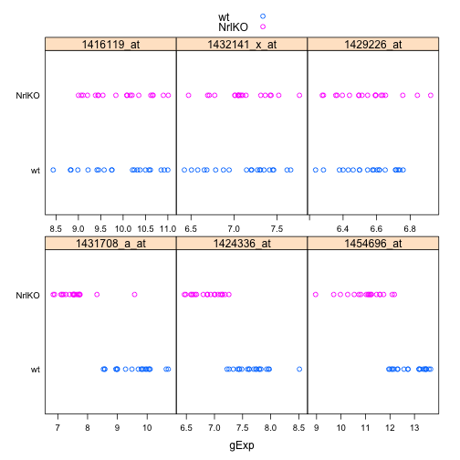

Seminar 4
========================================================

First read the data:

```r
library(lattice)
prDat <- read.table("/Users/fdorri/Documents/UBC/courses/STAT540/workspace/stat540_2014/examples/photoRec/data/GSE4051_data.tsv")
str(prDat, max.level = 0)
```

```
## 'data.frame':	29949 obs. of  39 variables:
```

```r
prDes <- readRDS("/Users/fdorri/Documents/UBC/courses/STAT540/workspace/stat540_2014/examples/photoRec/data/GSE4051_design.rds")
str(prDes)
```

```
## 'data.frame':	39 obs. of  4 variables:
##  $ sidChar : chr  "Sample_20" "Sample_21" "Sample_22" "Sample_23" ...
##  $ sidNum  : num  20 21 22 23 16 17 6 24 25 26 ...
##  $ devStage: Factor w/ 5 levels "E16","P2","P6",..: 1 1 1 1 1 1 1 2 2 2 ...
##  $ gType   : Factor w/ 2 levels "wt","NrlKO": 1 1 1 1 2 2 2 1 1 1 ...
```

Then, let's extract the data for one gene and put in a data. So first randomly choose a gene:

```r
set.seed(987)
(theGene <- sample(1:nrow(prDat), 1))
```

```
## [1] 14294
```

then extract the data for the selected gene:

```r
pDat <- data.frame(prDes, gExp = unlist(prDat[theGene, ]))
str(pDat)
```

```
## 'data.frame':	39 obs. of  5 variables:
##  $ sidChar : chr  "Sample_20" "Sample_21" "Sample_22" "Sample_23" ...
##  $ sidNum  : num  20 21 22 23 16 17 6 24 25 26 ...
##  $ devStage: Factor w/ 5 levels "E16","P2","P6",..: 1 1 1 1 1 1 1 2 2 2 ...
##  $ gType   : Factor w/ 2 levels "wt","NrlKO": 1 1 1 1 2 2 2 1 1 1 ...
##  $ gExp    : num  9.88 10.59 10.28 10.22 8.75 ...
```


```r
aggregate(gExp ~ gType, pDat, FUN = mean)
```

```
##   gType  gExp
## 1    wt 9.758
## 2 NrlKO 9.553
```

```r
stripplot(gType ~ gExp, pDat)
```

 


```r
t.test(gExp ~ gType, pDat)
```

```
## 
## 	Welch Two Sample t-test
## 
## data:  gExp by gType
## t = 1.479, df = 36.78, p-value = 0.1475
## alternative hypothesis: true difference in means is not equal to 0
## 95 percent confidence interval:
##  -0.07586  0.48605
## sample estimates:
##    mean in group wt mean in group NrlKO 
##               9.758               9.553
```

```r
ttRes <- t.test(gExp ~ gType, pDat)
str(ttRes)
```

```
## List of 9
##  $ statistic  : Named num 1.48
##   ..- attr(*, "names")= chr "t"
##  $ parameter  : Named num 36.8
##   ..- attr(*, "names")= chr "df"
##  $ p.value    : num 0.148
##  $ conf.int   : atomic [1:2] -0.0759 0.4861
##   ..- attr(*, "conf.level")= num 0.95
##  $ estimate   : Named num [1:2] 9.76 9.55
##   ..- attr(*, "names")= chr [1:2] "mean in group wt" "mean in group NrlKO"
##  $ null.value : Named num 0
##   ..- attr(*, "names")= chr "difference in means"
##  $ alternative: chr "two.sided"
##  $ method     : chr "Welch Two Sample t-test"
##  $ data.name  : chr "gExp by gType"
##  - attr(*, "class")= chr "htest"
```

```r
ttRes$statistic
```

```
##     t 
## 1.479
```

```r
ttRes$p.value
```

```
## [1] 0.1475
```


```r
kDat <- readRDS("/Users/fdorri/Documents/UBC/courses/STAT540/workspace/stat540_2014/examples/photoRec/data/GSE4051_MINI.rds")
kMat <- as.matrix(kDat[c("crabHammer", "eggBomb", "poisonFang")])
str(kMat)
```

```
##  num [1:39, 1:3] 10.22 10.02 9.64 9.65 8.58 ...
##  - attr(*, "dimnames")=List of 2
##   ..$ : chr [1:39] "12" "13" "14" "15" ...
##   ..$ : chr [1:3] "crabHammer" "eggBomb" "poisonFang"
```

```r
median(kMat[, 1])  # column numbers are mysterious
```

```
## [1] 9.611
```

```r
median(kMat[, "eggBomb"])  # use names for better code!
```

```
## [1] 6.757
```

```r
apply(kMat, 1, median)  # here it means the first dimension!! not the first column :)
```

```
##    12    13    14    15     9    10    11    28    29    30    31    24 
## 7.462 7.177 7.350 7.040 7.494 7.065 7.017 7.508 7.449 7.511 7.843 7.250 
##    25    26    27    36    37    38    39    32    33    34    35    20 
## 7.200 7.405 8.016 7.428 7.574 7.274 7.409 7.378 7.252 7.342 7.754 8.173 
##    21    22    23    16    17    18    19     5     6     7     8     1 
## 8.086 8.519 7.201 7.459 7.786 7.438 7.586 7.866 7.324 7.329 7.320 7.204 
##     2     3     4 
## 7.350 7.107 7.043
```

```r
apply(kMat, 2, median)
```

```
## crabHammer    eggBomb poisonFang 
##      9.611      6.757      7.350
```

```r
apply(kMat, 2, quantile, probs = 0.5)
```

```
## crabHammer    eggBomb poisonFang 
##      9.611      6.757      7.350
```

```r
apply(kMat, 2, quantile, probs = c(0.25, 0.75))
```

```
##     crabHammer eggBomb poisonFang
## 25%      8.938   6.278      7.188
## 75%      9.830   7.095      7.476
```


```r
colnames(kMat)[apply(kMat, 1, which.min)]
```

```
##  [1] "poisonFang" "eggBomb"    "eggBomb"    "eggBomb"    "eggBomb"   
##  [6] "poisonFang" "poisonFang" "eggBomb"    "eggBomb"    "eggBomb"   
## [11] "eggBomb"    "eggBomb"    "eggBomb"    "eggBomb"    "eggBomb"   
## [16] "eggBomb"    "poisonFang" "eggBomb"    "eggBomb"    "eggBomb"   
## [21] "eggBomb"    "eggBomb"    "eggBomb"    "poisonFang" "eggBomb"   
## [26] "eggBomb"    "eggBomb"    "eggBomb"    "eggBomb"    "poisonFang"
## [31] "eggBomb"    "poisonFang" "eggBomb"    "eggBomb"    "eggBomb"   
## [36] "poisonFang" "eggBomb"    "poisonFang" "eggBomb"
```

```r
rowSums(kMat)  #see also rowSums, colMeans, colSums
```

```
##    12    13    14    15     9    10    11    28    29    30    31    24 
## 25.05 24.09 23.71 23.22 22.55 24.21 24.09 22.96 22.66 23.99 23.26 22.96 
##    25    26    27    36    37    38    39    32    33    34    35    20 
## 22.78 22.60 23.40 22.17 24.80 22.49 22.31 22.58 23.14 22.60 22.75 25.43 
##    21    22    23    16    17    18    19     5     6     7     8     1 
## 24.17 23.86 21.80 24.52 24.76 24.94 24.44 24.82 23.98 23.70 24.52 23.86 
##     2     3     4 
## 23.64 23.93 23.42
```

```r
all.equal(rowSums(kMat), apply(kMat, 1, sum))
```

```
## [1] TRUE
```

```r
colMeans(kMat)
```

```
## crabHammer    eggBomb poisonFang 
##      9.428      6.788      7.379
```

```r
all.equal(colMeans(kMat), apply(kMat, 2, mean))
```

```
## [1] TRUE
```

```r
jRowSums <- rowSums(prDat)
jRowSums <- apply(prDat, 1, sum)
prMat <- as.matrix(prDat)  # must have an actual matrix
jRowSums <- rep(NA, nrow(prDat))  # must initialize a receptacle
for (i in 1:nrow(prDat)) {
    jRowSums[i] <- sum(prMat[i, ])
}
aggregate(eggBomb ~ devStage, kDat, FUN = mean)
```

```
##   devStage eggBomb
## 1      E16   6.879
## 2       P2   6.408
## 3       P6   6.459
## 4      P10   7.143
## 5  4_weeks   7.063
```

```r
aggregate(eggBomb ~ gType * devStage, kDat, FUN = mean)
```

```
##    gType devStage eggBomb
## 1     wt      E16   6.900
## 2  NrlKO      E16   6.851
## 3     wt       P2   6.607
## 4  NrlKO       P2   6.209
## 5     wt       P6   6.646
## 6  NrlKO       P6   6.273
## 7     wt      P10   7.042
## 8  NrlKO      P10   7.243
## 9     wt  4_weeks   7.117
## 10 NrlKO  4_weeks   7.008
```

```r
aggregate(eggBomb ~ gType * devStage, kDat, FUN = range)
```

```
##    gType devStage eggBomb.1 eggBomb.2
## 1     wt      E16     6.529     7.462
## 2  NrlKO      E16     6.470     7.065
## 3     wt       P2     6.170     6.870
## 4  NrlKO       P2     6.138     6.269
## 5     wt       P6     6.211     7.574
## 6  NrlKO       P6     6.188     6.347
## 7     wt      P10     6.155     8.173
## 8  NrlKO      P10     7.081     7.438
## 9     wt  4_weeks     6.608     7.866
## 10 NrlKO  4_weeks     6.558     7.204
```

```r
keepGenes <- c("1431708_a_at", "1424336_at", "1454696_at", "1416119_at", "1432141_x_at", 
    "1429226_at")
miniDat <- subset(prDat, rownames(prDat) %in% keepGenes)
miniDat <- data.frame(gExp = as.vector(t(as.matrix(miniDat))), gene = factor(rep(rownames(miniDat), 
    each = ncol(miniDat)), levels = keepGenes))
miniDat <- suppressWarnings(data.frame(prDes, miniDat))
str(miniDat)
```

```
## 'data.frame':	234 obs. of  6 variables:
##  $ sidChar : chr  "Sample_20" "Sample_21" "Sample_22" "Sample_23" ...
##  $ sidNum  : num  20 21 22 23 16 17 6 24 25 26 ...
##  $ devStage: Factor w/ 5 levels "E16","P2","P6",..: 1 1 1 1 1 1 1 2 2 2 ...
##  $ gType   : Factor w/ 2 levels "wt","NrlKO": 1 1 1 1 2 2 2 1 1 1 ...
##  $ gExp    : num  10.6 11 10.8 10.9 9.2 ...
##  $ gene    : Factor w/ 6 levels "1431708_a_at",..: 4 4 4 4 4 4 4 4 4 4 ...
```

```r
stripplot(gType ~ gExp | gene, miniDat, scales = list(x = list(relation = "free")), 
    group = gType, auto.key = TRUE)
```

 


