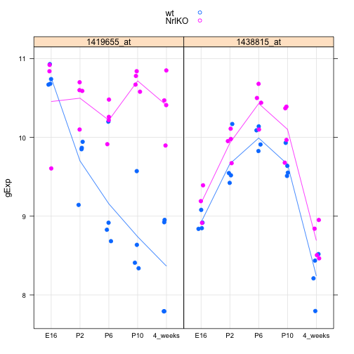

Seminar 5
========================================================


```r
library(lattice)
# source() #to source function in a seperate file
prepareData <- function(luckyGenes, prDes) {
    geneList <- prDat[luckyGenes, ]
    # geneVec <- as.vector (geneList) #change each element of list to a vector
    geneMatrix <- as.matrix(geneList)
    geneVec <- as.vector(t(geneMatrix))
    
    geneName <- rep(luckyGenes, each = 39)
    
    jDat <- data.frame(prDes, gExp = geneVec, geneName)
    return(jDat)
}

makeStripplot <- function(jDat, pch, cex) {
    stripplot(gExp ~ devStage | geneName, jDat, group = gType, jitter.data = TRUE, 
        auto.key = TRUE, type = c("p", "a"), grid = TRUE, pch = pch, cex = cex)
}


prDat <- read.table("/Users/fdorri/Documents/UBC/courses/STAT540/workspace/stat540_2014/examples/photoRec/data/GSE4051_data.tsv")
str(prDat, max.level = 0)
```

```
## 'data.frame':	29949 obs. of  39 variables:
```

```r
prDes <- readRDS("/Users/fdorri/Documents/UBC/courses/STAT540/workspace/stat540_2014/examples/photoRec/data/GSE4051_design.rds")
str(prDes)
```

```
## 'data.frame':	39 obs. of  4 variables:
##  $ sidChar : chr  "Sample_20" "Sample_21" "Sample_22" "Sample_23" ...
##  $ sidNum  : num  20 21 22 23 16 17 6 24 25 26 ...
##  $ devStage: Factor w/ 5 levels "E16","P2","P6",..: 1 1 1 1 1 1 1 2 2 2 ...
##  $ gType   : Factor w/ 2 levels "wt","NrlKO": 1 1 1 1 2 2 2 1 1 1 ...
```

```r


(luckyGenes <- c("1419655_at", "1438815_at"))
```

```
## [1] "1419655_at" "1438815_at"
```

```r
jDat <- prepareData(luckyGenes, prDes)
```

```
## Warning: row names were found from a short variable and have been
## discarded
```

```r
str(jDat)
```

```
## 'data.frame':	78 obs. of  6 variables:
##  $ sidChar : chr  "Sample_20" "Sample_21" "Sample_22" "Sample_23" ...
##  $ sidNum  : num  20 21 22 23 16 17 6 24 25 26 ...
##  $ devStage: Factor w/ 5 levels "E16","P2","P6",..: 1 1 1 1 1 1 1 2 2 2 ...
##  $ gType   : Factor w/ 2 levels "wt","NrlKO": 1 1 1 1 2 2 2 1 1 1 ...
##  $ gExp    : num  10.93 10.74 10.67 10.68 9.61 ...
##  $ geneName: Factor w/ 2 levels "1419655_at","1438815_at": 1 1 1 1 1 1 1 1 1 1 ...
```

```r

head(jDat)
```

```
##     sidChar sidNum devStage gType   gExp   geneName
## 1 Sample_20     20      E16    wt 10.930 1419655_at
## 2 Sample_21     21      E16    wt 10.740 1419655_at
## 3 Sample_22     22      E16    wt 10.670 1419655_at
## 4 Sample_23     23      E16    wt 10.680 1419655_at
## 5 Sample_16     16      E16 NrlKO  9.606 1419655_at
## 6 Sample_17     17      E16 NrlKO 10.840 1419655_at
```

```r
tail(jDat)
```

```
##      sidChar sidNum devStage gType  gExp   geneName
## 73 Sample_38     38  4_weeks    wt 8.211 1438815_at
## 74 Sample_39     39  4_weeks    wt 8.436 1438815_at
## 75 Sample_11     11  4_weeks NrlKO 8.465 1438815_at
## 76 Sample_12     12  4_weeks NrlKO 8.841 1438815_at
## 77  Sample_2      2  4_weeks NrlKO 8.506 1438815_at
## 78  Sample_9      9  4_weeks NrlKO 8.952 1438815_at
```

```r
makeStripplot(jDat, pch = 20, cex = 1.3)
```

 


