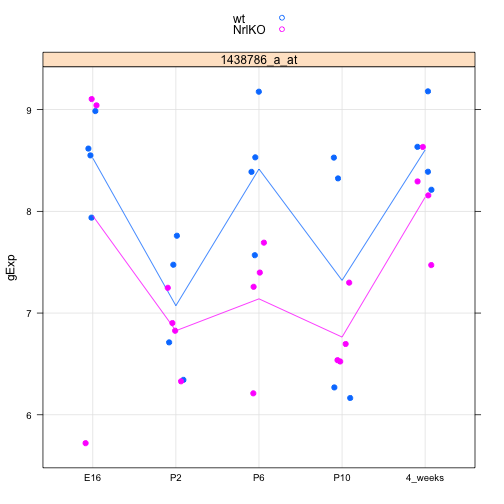
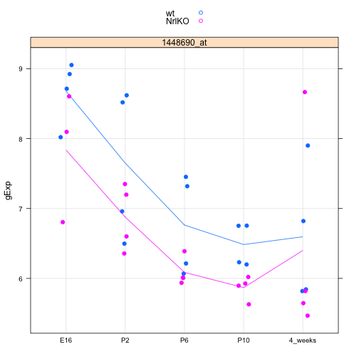
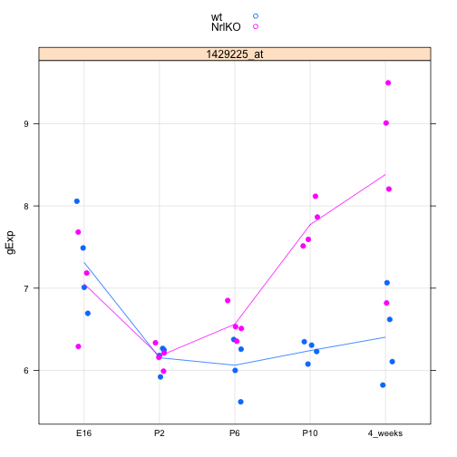

Seminar 5
========================================================


```r
library(lattice)
# source() #to source function in a seperate file
prepareData <- function(prDat, prDes, luckyGenes) {
    geneList <- prDat[luckyGenes, ]
    # geneVec <- as.vector (geneList) #change each element of list to a vector
    geneMatrix <- as.matrix(geneList)
    geneVec <- as.vector(t(geneMatrix))
    
    geneName <- rep(luckyGenes, each = 39)
    
    jDat <- data.frame(prDes, gExp = geneVec, geneName)
    return(jDat)
}

makeStripplot <- function(jDat, pch, cex) {
    stripplot(gExp ~ devStage | geneName, jDat, group = gType, jitter.data = TRUE, 
        auto.key = TRUE, type = c("p", "a"), grid = TRUE, pch = pch, cex = cex)
}


prDat <- read.table("/Users/fdorri/Documents/UBC/courses/STAT540/workspace/stat540_2014/examples/photoRec/data/GSE4051_data.tsv")
str(prDat, max.level = 0)
```

```
## 'data.frame':	29949 obs. of  39 variables:
```

```r
prDes <- readRDS("/Users/fdorri/Documents/UBC/courses/STAT540/workspace/stat540_2014/examples/photoRec/data/GSE4051_design.rds")
str(prDes)
```

```
## 'data.frame':	39 obs. of  4 variables:
##  $ sidChar : chr  "Sample_20" "Sample_21" "Sample_22" "Sample_23" ...
##  $ sidNum  : num  20 21 22 23 16 17 6 24 25 26 ...
##  $ devStage: Factor w/ 5 levels "E16","P2","P6",..: 1 1 1 1 1 1 1 2 2 2 ...
##  $ gType   : Factor w/ 2 levels "wt","NrlKO": 1 1 1 1 2 2 2 1 1 1 ...
```

```r


(luckyGenes <- c("1419655_at", "1438815_at"))
```

```
## [1] "1419655_at" "1438815_at"
```

```r
newDat <- prepareData(prDat, prDes, luckyGenes)
```

```
## Warning: row names were found from a short variable and have been
## discarded
```

```r
str(newDat)
```

```
## 'data.frame':	78 obs. of  6 variables:
##  $ sidChar : chr  "Sample_20" "Sample_21" "Sample_22" "Sample_23" ...
##  $ sidNum  : num  20 21 22 23 16 17 6 24 25 26 ...
##  $ devStage: Factor w/ 5 levels "E16","P2","P6",..: 1 1 1 1 1 1 1 2 2 2 ...
##  $ gType   : Factor w/ 2 levels "wt","NrlKO": 1 1 1 1 2 2 2 1 1 1 ...
##  $ gExp    : num  10.93 10.74 10.67 10.68 9.61 ...
##  $ geneName: Factor w/ 2 levels "1419655_at","1438815_at": 1 1 1 1 1 1 1 1 1 1 ...
```

```r

head(newDat)
```

```
##     sidChar sidNum devStage gType   gExp   geneName
## 1 Sample_20     20      E16    wt 10.930 1419655_at
## 2 Sample_21     21      E16    wt 10.740 1419655_at
## 3 Sample_22     22      E16    wt 10.670 1419655_at
## 4 Sample_23     23      E16    wt 10.680 1419655_at
## 5 Sample_16     16      E16 NrlKO  9.606 1419655_at
## 6 Sample_17     17      E16 NrlKO 10.840 1419655_at
```

```r
tail(newDat)
```

```
##      sidChar sidNum devStage gType  gExp   geneName
## 73 Sample_38     38  4_weeks    wt 8.211 1438815_at
## 74 Sample_39     39  4_weeks    wt 8.436 1438815_at
## 75 Sample_11     11  4_weeks NrlKO 8.465 1438815_at
## 76 Sample_12     12  4_weeks NrlKO 8.841 1438815_at
## 77  Sample_2      2  4_weeks NrlKO 8.506 1438815_at
## 78  Sample_9      9  4_weeks NrlKO 8.952 1438815_at
```

```r
makeStripplot(newDat, pch = 20, cex = 1.3)
```

 


```r
luckyGenes <- c("1456341_a_at")
newDat <- prepareData(prDat, prDes, luckyGenes)
sub <- subset(newDat, devStage == "P2" | devStage == "4_weeks")
t.test(sub$gExp ~ sub$devStage, var.equal = T)
```

```
## 
## 	Two Sample t-test
## 
## data:  sub$gExp by sub$devStage
## t = -18.84, df = 14, p-value = 2.411e-11
## alternative hypothesis: true difference in means is not equal to 0
## 95 percent confidence interval:
##  -4.078 -3.244
## sample estimates:
##      mean in group P2 mean in group 4_weeks 
##                 6.326                 9.987
```


```r
luckyGenes <- c("1438786_a_at")
newDat <- prepareData(prDat, prDes, luckyGenes)
makeStripplot(newDat, pch = 20, cex = 1.3)
```

 

```r
mod_1 <- lm(formula = gExp ~ devStage, data = newDat, subset = gType == "wt")
summary(mod_1)
```

```
## 
## Call:
## lm(formula = gExp ~ devStage, data = newDat, subset = gType == 
##     "wt")
## 
## Residuals:
##     Min      1Q  Median      3Q     Max 
## -1.1565 -0.4400  0.0288  0.4915  1.2065 
## 
## Coefficients:
##                 Estimate Std. Error t value Pr(>|t|)    
## (Intercept)        8.523      0.379   22.50  5.7e-13 ***
## devStageP2        -1.450      0.536   -2.71    0.016 *  
## devStageP6        -0.107      0.536   -0.20    0.845    
## devStageP10       -1.201      0.536   -2.24    0.040 *  
## devStage4_weeks    0.081      0.536    0.15    0.882    
## ---
## Signif. codes:  0 '***' 0.001 '**' 0.01 '*' 0.05 '.' 0.1 ' ' 1
## 
## Residual standard error: 0.758 on 15 degrees of freedom
## Multiple R-squared:  0.497,	Adjusted R-squared:  0.363 
## F-statistic: 3.71 on 4 and 15 DF,  p-value: 0.0272
```


```r
coef(mod_1)
```

```
##     (Intercept)      devStageP2      devStageP6     devStageP10 
##          8.5227         -1.4503         -0.1067         -1.2012 
## devStage4_weeks 
##          0.0810
```

```r
contrast_M <- matrix(c(0, 1, 0, -1, 0), nrow = 1)
(obsDiff <- contrast_M %*% coef(mod_1))
```

```
##        [,1]
## [1,] -0.249
```

```r
coef(mod_1)
```

```
##     (Intercept)      devStageP2      devStageP6     devStageP10 
##          8.5227         -1.4503         -0.1067         -1.2012 
## devStage4_weeks 
##          0.0810
```

```r
sampMeans <- aggregate(gExp ~ devStage, newDat, FUN = mean, subset = gType == 
    "wt")
sampMeans
```

```
##   devStage  gExp
## 1      E16 8.523
## 2       P2 7.072
## 3       P6 8.416
## 4      P10 7.322
## 5  4_weeks 8.604
```

```r

with(sampMeans, gExp[devStage == "P2"] - gExp[devStage == "P10"])  #The with( ) function applys an expression to a dataset.
```

```
## [1] -0.249
```

```r
vcov(mod_1)  #Returns the variance-covariance matrix of the main parameters of a fitted model object
```

```
##                 (Intercept) devStageP2 devStageP6 devStageP10
## (Intercept)          0.1435    -0.1435    -0.1435     -0.1435
## devStageP2          -0.1435     0.2870     0.1435      0.1435
## devStageP6          -0.1435     0.1435     0.2870      0.1435
## devStageP10         -0.1435     0.1435     0.1435      0.2870
## devStage4_weeks     -0.1435     0.1435     0.1435      0.1435
##                 devStage4_weeks
## (Intercept)             -0.1435
## devStageP2               0.1435
## devStageP6               0.1435
## devStageP10              0.1435
## devStage4_weeks          0.2870
```

```r
summary(mod_1)$coefficients[, "Std. Error"]
```

```
##     (Intercept)      devStageP2      devStageP6     devStageP10 
##          0.3788          0.5357          0.5357          0.5357 
## devStage4_weeks 
##          0.5357
```

```r
sqrt(diag(vcov(mod_1)))
```

```
##     (Intercept)      devStageP2      devStageP6     devStageP10 
##          0.3788          0.5357          0.5357          0.5357 
## devStage4_weeks 
##          0.5357
```

```r
(estSe <- contrast_M %*% vcov(mod_1) %*% t(contrast_M))
```

```
##       [,1]
## [1,] 0.287
```

```r
(testStat <- obsDiff/estSe)
```

```
##         [,1]
## [1,] -0.8676
```

```r
2 * pt(abs(testStat), df = df.residual(mod_1), lower.tail = FALSE)
```

```
##        [,1]
## [1,] 0.3993
```


```r

makeStripplot(newDat <- prepareData(prDat, prDes, "1448690_at"), pch = 20, cex = 1.3)
```

 

```r
str(newDat)
```

```
## 'data.frame':	39 obs. of  6 variables:
##  $ sidChar : chr  "Sample_20" "Sample_21" "Sample_22" "Sample_23" ...
##  $ sidNum  : num  20 21 22 23 16 17 6 24 25 26 ...
##  $ devStage: Factor w/ 5 levels "E16","P2","P6",..: 1 1 1 1 1 1 1 2 2 2 ...
##  $ gType   : Factor w/ 2 levels "wt","NrlKO": 1 1 1 1 2 2 2 1 1 1 ...
##  $ gExp    : num  8.02 9.05 8.71 8.92 6.8 ...
##  $ geneName: Factor w/ 1 level "1448690_at": 1 1 1 1 1 1 1 1 1 1 ...
```

```r
mod_2 <- lm(formula = gExp ~ gType * devStage, data = newDat)  #including the interaction
summary(mod_2)$coef
```

```
##                            Estimate Std. Error  t value  Pr(>|t|)
## (Intercept)                 8.67800     0.3987 21.76755 1.634e-19
## gTypeNrlKO                 -0.84233     0.6090 -1.38320 1.772e-01
## devStageP2                 -1.02900     0.5638 -1.82512 7.830e-02
## devStageP6                 -1.91450     0.5638 -3.39571 2.003e-03
## devStageP10                -2.19325     0.5638 -3.89012 5.387e-04
## devStage4_weeks            -2.08200     0.5638 -3.69280 9.149e-04
## gTypeNrlKO:devStageP2       0.06983     0.8299  0.08415 9.335e-01
## gTypeNrlKO:devStageP6       0.16533     0.8299  0.19922 8.435e-01
## gTypeNrlKO:devStageP10      0.22583     0.8299  0.27212 7.875e-01
## gTypeNrlKO:devStage4_weeks  0.64608     0.8299  0.77852 4.426e-01
```

```r
mod_3 <- lm(formula = gExp ~ gType + devStage, data = newDat)  #without interaction
summary(mod_3)$coef
```

```
##                 Estimate Std. Error t value  Pr(>|t|)
## (Intercept)       8.5803     0.3046  28.165 1.177e-24
## gTypeNrlKO       -0.6144     0.2430  -2.528 1.643e-02
## devStageP2       -1.0104     0.3924  -2.575 1.470e-02
## devStageP6       -1.8481     0.3924  -4.710 4.328e-05
## devStageP10      -2.0966     0.3924  -5.343 6.703e-06
## devStage4_weeks  -1.7752     0.3924  -4.524 7.444e-05
```

```r
anova(mod_2, mod_3)
```

```
## Analysis of Variance Table
## 
## Model 1: gExp ~ gType * devStage
## Model 2: gExp ~ gType + devStage
##   Res.Df  RSS Df Sum of Sq   F Pr(>F)
## 1     29 18.4                        
## 2     33 18.9 -4    -0.497 0.2   0.94
```


```r
makeStripplot(newDat <- prepareData(prDat, prDes, "1429225_at"), pch = 20, cex = 1.3)
```

 

```r
str(newDat)
```

```
## 'data.frame':	39 obs. of  6 variables:
##  $ sidChar : chr  "Sample_20" "Sample_21" "Sample_22" "Sample_23" ...
##  $ sidNum  : num  20 21 22 23 16 17 6 24 25 26 ...
##  $ devStage: Factor w/ 5 levels "E16","P2","P6",..: 1 1 1 1 1 1 1 2 2 2 ...
##  $ gType   : Factor w/ 2 levels "wt","NrlKO": 1 1 1 1 2 2 2 1 1 1 ...
##  $ gExp    : num  7.01 8.06 6.69 7.49 6.29 ...
##  $ geneName: Factor w/ 1 level "1429225_at": 1 1 1 1 1 1 1 1 1 1 ...
```

```r
mod_4 <- lm(formula = gExp ~ gType * devStage, data = newDat)  #including the interaction
summary(mod_4)$coef
```

```
##                            Estimate Std. Error t value  Pr(>|t|)
## (Intercept)                  7.3125     0.2617 27.9391 1.619e-22
## gTypeNrlKO                  -0.2602     0.3998 -0.6507 5.203e-01
## devStageP2                  -1.1583     0.3701 -3.1292 3.973e-03
## devStageP6                  -1.2495     0.3701 -3.3757 2.110e-03
## devStageP10                 -1.0718     0.3701 -2.8955 7.125e-03
## devStage4_weeks             -0.9088     0.3701 -2.4551 2.032e-02
## gTypeNrlKO:devStageP2        0.2804     0.5448  0.5147 6.107e-01
## gTypeNrlKO:devStageP6        0.7589     0.5448  1.3929 1.742e-01
## gTypeNrlKO:devStageP10       1.7914     0.5448  3.2880 2.648e-03
## gTypeNrlKO:devStage4_weeks   2.2389     0.5448  4.1094 2.970e-04
```

```r
mod_5 <- lm(formula = gExp ~ gType + devStage, data = newDat)  #without interaction
summary(mod_5)$coef
```

```
##                 Estimate Std. Error t value  Pr(>|t|)
## (Intercept)       6.8652     0.2722 25.2199 3.848e-23
## gTypeNrlKO        0.7836     0.2172  3.6085 1.007e-03
## devStageP2       -1.0926     0.3506 -3.1161 3.780e-03
## devStageP6       -0.9446     0.3506 -2.6940 1.101e-02
## devStageP10      -0.2506     0.3506 -0.7147 4.798e-01
## devStage4_weeks   0.1362     0.3506  0.3883 7.003e-01
```

```r
anova(mod_4, mod_5)
```

```
## Analysis of Variance Table
## 
## Model 1: gExp ~ gType * devStage
## Model 2: gExp ~ gType + devStage
##   Res.Df   RSS Df Sum of Sq    F Pr(>F)    
## 1     29  7.95                             
## 2     33 15.12 -4     -7.17 6.54  7e-04 ***
## ---
## Signif. codes:  0 '***' 0.001 '**' 0.01 '*' 0.05 '.' 0.1 ' ' 1
```


