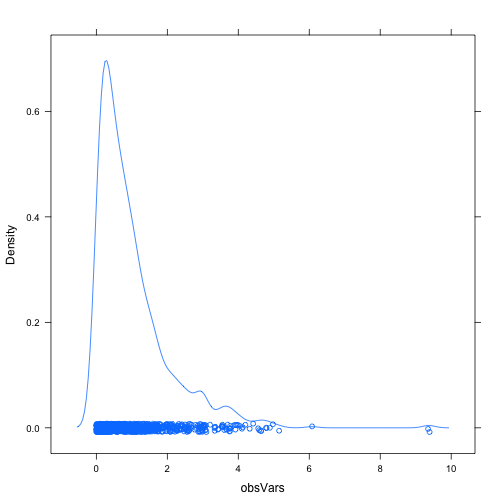
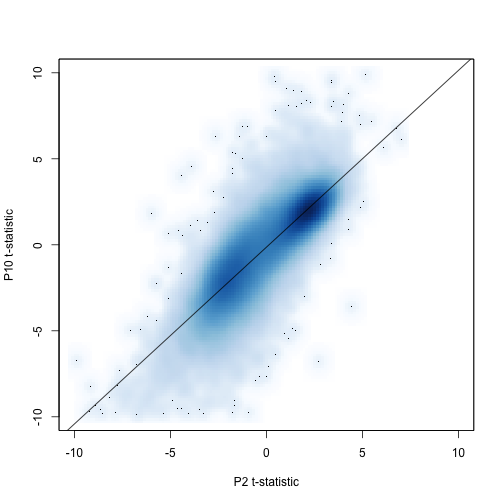

Seminar 6
========================================================


```r
library(limma)
library(lattice)

makeStripplot <- function(jDat, pch, cex) {
    stripplot(gExp ~ devStage | geneName, jDat, group = gType, jitter.data = TRUE, 
        auto.key = TRUE, type = c("p", "a"), grid = TRUE, pch = pch, cex = cex)
}
prDat <- read.table("/Users/fdorri/Documents/UBC/courses/STAT540/workspace/stat540_2014/examples/photoRec/data/GSE4051_data.tsv")
str(prDat, max.level = 0)
```

```
## 'data.frame':	29949 obs. of  39 variables:
```

```r
prDes <- readRDS("/Users/fdorri/Documents/UBC/courses/STAT540/workspace/stat540_2014/examples/photoRec/data/GSE4051_design.rds")
str(prDes)
```

```
## 'data.frame':	39 obs. of  4 variables:
##  $ sidChar : chr  "Sample_20" "Sample_21" "Sample_22" "Sample_23" ...
##  $ sidNum  : num  20 21 22 23 16 17 6 24 25 26 ...
##  $ devStage: Factor w/ 5 levels "E16","P2","P6",..: 1 1 1 1 1 1 1 2 2 2 ...
##  $ gType   : Factor w/ 2 levels "wt","NrlKO": 1 1 1 1 2 2 2 1 1 1 ...
```


```r
m <- 1000
n <- 3
x <- matrix(rnorm(m * n), nrow = m)
obsVars <- apply(x, 1, var)
summary(obsVars)
```

```
##    Min. 1st Qu.  Median    Mean 3rd Qu.    Max. 
##   0.000   0.294   0.704   1.020   1.370   9.390
```

```r
mean(obsVars < 1/3)
```

```
## [1] 0.286
```

```r
densityplot(~obsVars, n = 200)
```

 


```r
prDes
```

```
##      sidChar sidNum devStage gType
## 12 Sample_20     20      E16    wt
## 13 Sample_21     21      E16    wt
## 14 Sample_22     22      E16    wt
## 15 Sample_23     23      E16    wt
## 9  Sample_16     16      E16 NrlKO
## 10 Sample_17     17      E16 NrlKO
## 11  Sample_6      6      E16 NrlKO
## 28 Sample_24     24       P2    wt
## 29 Sample_25     25       P2    wt
## 30 Sample_26     26       P2    wt
## 31 Sample_27     27       P2    wt
## 24 Sample_14     14       P2 NrlKO
## 25  Sample_3      3       P2 NrlKO
## 26  Sample_5      5       P2 NrlKO
## 27  Sample_8      8       P2 NrlKO
## 36 Sample_28     28       P6    wt
## 37 Sample_29     29       P6    wt
## 38 Sample_30     30       P6    wt
## 39 Sample_31     31       P6    wt
## 32  Sample_1      1       P6 NrlKO
## 33 Sample_10     10       P6 NrlKO
## 34  Sample_4      4       P6 NrlKO
## 35  Sample_7      7       P6 NrlKO
## 20 Sample_32     32      P10    wt
## 21 Sample_33     33      P10    wt
## 22 Sample_34     34      P10    wt
## 23 Sample_35     35      P10    wt
## 16 Sample_13     13      P10 NrlKO
## 17 Sample_15     15      P10 NrlKO
## 18 Sample_18     18      P10 NrlKO
## 19 Sample_19     19      P10 NrlKO
## 5  Sample_36     36  4_weeks    wt
## 6  Sample_37     37  4_weeks    wt
## 7  Sample_38     38  4_weeks    wt
## 8  Sample_39     39  4_weeks    wt
## 1  Sample_11     11  4_weeks NrlKO
## 2  Sample_12     12  4_weeks NrlKO
## 3   Sample_2      2  4_weeks NrlKO
## 4   Sample_9      9  4_weeks NrlKO
```

```r
wtDes <- subset(prDes, gType == "wt")
wtDes
```

```
##      sidChar sidNum devStage gType
## 12 Sample_20     20      E16    wt
## 13 Sample_21     21      E16    wt
## 14 Sample_22     22      E16    wt
## 15 Sample_23     23      E16    wt
## 28 Sample_24     24       P2    wt
## 29 Sample_25     25       P2    wt
## 30 Sample_26     26       P2    wt
## 31 Sample_27     27       P2    wt
## 36 Sample_28     28       P6    wt
## 37 Sample_29     29       P6    wt
## 38 Sample_30     30       P6    wt
## 39 Sample_31     31       P6    wt
## 20 Sample_32     32      P10    wt
## 21 Sample_33     33      P10    wt
## 22 Sample_34     34      P10    wt
## 23 Sample_35     35      P10    wt
## 5  Sample_36     36  4_weeks    wt
## 6  Sample_37     37  4_weeks    wt
## 7  Sample_38     38  4_weeks    wt
## 8  Sample_39     39  4_weeks    wt
```

```r
str(wtDes)
```

```
## 'data.frame':	20 obs. of  4 variables:
##  $ sidChar : chr  "Sample_20" "Sample_21" "Sample_22" "Sample_23" ...
##  $ sidNum  : num  20 21 22 23 24 25 26 27 28 29 ...
##  $ devStage: Factor w/ 5 levels "E16","P2","P6",..: 1 1 1 1 2 2 2 2 3 3 ...
##  $ gType   : Factor w/ 2 levels "wt","NrlKO": 1 1 1 1 1 1 1 1 1 1 ...
```

```r
wtDat <- subset(prDat, select = prDes$gType == "wt")
str(wtDat, max.level = 0)
```

```
## 'data.frame':	29949 obs. of  20 variables:
```

```r
wtDesMat <- model.matrix(~devStage, wtDes)
wtDesMat
```

```
##    (Intercept) devStageP2 devStageP6 devStageP10 devStage4_weeks
## 12           1          0          0           0               0
## 13           1          0          0           0               0
## 14           1          0          0           0               0
## 15           1          0          0           0               0
## 28           1          1          0           0               0
## 29           1          1          0           0               0
## 30           1          1          0           0               0
## 31           1          1          0           0               0
## 36           1          0          1           0               0
## 37           1          0          1           0               0
## 38           1          0          1           0               0
## 39           1          0          1           0               0
## 20           1          0          0           1               0
## 21           1          0          0           1               0
## 22           1          0          0           1               0
## 23           1          0          0           1               0
## 5            1          0          0           0               1
## 6            1          0          0           0               1
## 7            1          0          0           0               1
## 8            1          0          0           0               1
## attr(,"assign")
## [1] 0 1 1 1 1
## attr(,"contrasts")
## attr(,"contrasts")$devStage
## [1] "contr.treatment"
```

```r
str(wtDesMat)
```

```
##  num [1:20, 1:5] 1 1 1 1 1 1 1 1 1 1 ...
##  - attr(*, "dimnames")=List of 2
##   ..$ : chr [1:20] "12" "13" "14" "15" ...
##   ..$ : chr [1:5] "(Intercept)" "devStageP2" "devStageP6" "devStageP10" ...
##  - attr(*, "assign")= int [1:5] 0 1 1 1 1
##  - attr(*, "contrasts")=List of 1
##   ..$ devStage: chr "contr.treatment"
```


```r
wtFit <- lmFit(wtDat, wtDesMat)
wtEbFit <- eBayes(wtFit)
topTable(wtEbFit)
```

```
##              X.Intercept. devStageP2 devStageP6 devStageP10
## 1423641_s_at        12.18    -0.0175     0.0750      0.0675
## 1438940_x_at        12.86     0.0850     0.1325      0.3425
## 1438657_x_at        12.78     0.1400     0.1250     -0.1850
## 1456736_x_at        12.32     0.1625     0.3050      0.2075
## 1436884_x_at        12.93     0.1775     0.3225      0.0300
## 1419700_a_at        12.32     0.1650     0.6475      0.8175
## 1435800_a_at        12.28     0.0450     0.6825      0.9000
## 1454613_at          12.47    -0.1075    -0.0500     -0.1025
## 1451240_a_at        13.00     0.3100     0.2800      0.2800
## 1450084_s_at        12.63     0.0825     0.0525      0.1725
##              devStage4_weeks AveExpr     F   P.Value adj.P.Val
## 1423641_s_at          0.1800   12.24 45350 3.574e-36 5.201e-32
## 1438940_x_at          0.3500   13.04 44957 3.865e-36 5.201e-32
## 1438657_x_at         -0.4500   12.71 43486 5.210e-36 5.201e-32
## 1456736_x_at          0.0725   12.47 39509 1.233e-35 6.725e-32
## 1436884_x_at          0.0250   13.04 39269 1.302e-35 6.725e-32
## 1419700_a_at          0.6825   12.78 39121 1.347e-35 6.725e-32
## 1435800_a_at          1.0200   12.81 36668 2.410e-35 1.031e-31
## 1454613_at           -0.3825   12.34 35835 2.962e-35 1.078e-31
## 1451240_a_at         -0.3700   13.10 35481 3.239e-35 1.078e-31
## 1450084_s_at          0.2600   12.75 34411 4.265e-35 1.234e-31
```


```r
topTable(wtEbFit, coef = 2:5)
```

```
##              devStageP2 devStageP6 devStageP10 devStage4_weeks AveExpr
## 1440645_at       0.3990     0.1952      0.9200           3.961   6.528
## 1416041_at       0.1580     0.4797      0.3327           5.115   9.383
## 1425222_x_at     0.8820     0.7995      1.5488           5.532   7.028
## 1451635_at       1.3025     1.1900      2.0160           6.188   8.319
## 1429028_at      -2.4433    -3.4073     -4.3105          -4.602   8.045
## 1422929_s_at    -2.9117    -3.6182     -3.5472          -3.661   7.278
## 1424852_at       0.4575     0.2298      0.5740           3.979   7.454
## 1425171_at       0.9980     3.0530      5.2787           6.079   9.620
## 1451617_at       0.7255     2.5128      4.9837           6.685   8.817
## 1451618_at       0.6028     2.8903      5.0507           6.288   9.431
##                  F   P.Value adj.P.Val
## 1440645_at   425.4 1.588e-17 4.755e-13
## 1416041_at   195.5 1.522e-14 2.280e-10
## 1425222_x_at 173.4 4.348e-14 4.341e-10
## 1451635_at   157.3 1.013e-13 7.585e-10
## 1429028_at   148.8 1.646e-13 9.203e-10
## 1422929_s_at 146.9 1.844e-13 9.203e-10
## 1424852_at   143.2 2.290e-13 9.799e-10
## 1425171_at   138.8 3.002e-13 1.124e-09
## 1451617_at   136.5 3.485e-13 1.160e-09
## 1451618_at   134.2 4.032e-13 1.207e-09
```

```r
colnames(coef(wtEbFit))
```

```
## [1] "(Intercept)"     "devStageP2"      "devStageP6"      "devStageP10"    
## [5] "devStage4_weeks"
```

```r
(dsHits <- topTable(wtEbFit, coef = grep("devStage", colnames(coef(wtEbFit)))))
```

```
##              devStageP2 devStageP6 devStageP10 devStage4_weeks AveExpr
## 1440645_at       0.3990     0.1952      0.9200           3.961   6.528
## 1416041_at       0.1580     0.4797      0.3327           5.115   9.383
## 1425222_x_at     0.8820     0.7995      1.5488           5.532   7.028
## 1451635_at       1.3025     1.1900      2.0160           6.188   8.319
## 1429028_at      -2.4433    -3.4073     -4.3105          -4.602   8.045
## 1422929_s_at    -2.9117    -3.6182     -3.5472          -3.661   7.278
## 1424852_at       0.4575     0.2298      0.5740           3.979   7.454
## 1425171_at       0.9980     3.0530      5.2787           6.079   9.620
## 1451617_at       0.7255     2.5128      4.9837           6.685   8.817
## 1451618_at       0.6028     2.8903      5.0507           6.288   9.431
##                  F   P.Value adj.P.Val
## 1440645_at   425.4 1.588e-17 4.755e-13
## 1416041_at   195.5 1.522e-14 2.280e-10
## 1425222_x_at 173.4 4.348e-14 4.341e-10
## 1451635_at   157.3 1.013e-13 7.585e-10
## 1429028_at   148.8 1.646e-13 9.203e-10
## 1422929_s_at 146.9 1.844e-13 9.203e-10
## 1424852_at   143.2 2.290e-13 9.799e-10
## 1425171_at   138.8 3.002e-13 1.124e-09
## 1451617_at   136.5 3.485e-13 1.160e-09
## 1451618_at   134.2 4.032e-13 1.207e-09
```

```r
head(topTable(wtEbFit))
```

```
##              X.Intercept. devStageP2 devStageP6 devStageP10
## 1423641_s_at        12.18    -0.0175     0.0750      0.0675
## 1438940_x_at        12.86     0.0850     0.1325      0.3425
## 1438657_x_at        12.78     0.1400     0.1250     -0.1850
## 1456736_x_at        12.32     0.1625     0.3050      0.2075
## 1436884_x_at        12.93     0.1775     0.3225      0.0300
## 1419700_a_at        12.32     0.1650     0.6475      0.8175
##              devStage4_weeks AveExpr     F   P.Value adj.P.Val
## 1423641_s_at          0.1800   12.24 45350 3.574e-36 5.201e-32
## 1438940_x_at          0.3500   13.04 44957 3.865e-36 5.201e-32
## 1438657_x_at         -0.4500   12.71 43486 5.210e-36 5.201e-32
## 1456736_x_at          0.0725   12.47 39509 1.233e-35 6.725e-32
## 1436884_x_at          0.0250   13.04 39269 1.302e-35 6.725e-32
## 1419700_a_at          0.6825   12.78 39121 1.347e-35 6.725e-32
```

```r
(dsHits <- topTable(wtEbFit[64], coef = grep("devStageP6", colnames(coef(wtEbFit)))))
```

```
##               logFC AveExpr      t P.Value adj.P.Val      B
## 1415733_a_at -0.156    8.36 -1.123  0.2762    0.2762 -5.917
```


```r
# test the effect of developmental stage
p2hit <- topTable(wtEbFit, coef = "devStageP2", number = nrow(wtDat), sort.by = "none")
p10hit <- topTable(wtEbFit, coef = "devStageP10", number = nrow(wtDat), sort.by = "none")

# plot test statistics against one another
smoothScatter(p10hit$t ~ p2hit$t, xlab = "P2 t-statistic", ylab = "P10 t-statistic", 
    xlim = c(-10, 10), ylim = c(-10, 10))
```

```
## KernSmooth 2.23 loaded
## Copyright M. P. Wand 1997-2009
```

```r
# fit a line to the points
myline.fit <- lm(p10hit$t ~ p2hit$t)
abline(myline.fit)
```

 


```r

densityplot(~p10hit$adj.P + p2hit$adj.P, xlab = "adjusted p-values", plot.points = F, 
    scales = list(tck = c(1, 0)))
```

 

```r

# p-values < 0.001
addmargins(table(p2hit$adj.P < 0.001, p10hit$adj.P < 0.001, dnn = c("P2", "P10")))
```

```
##        P10
## P2      FALSE  TRUE   Sum
##   FALSE 29201   695 29896
##   TRUE      1    52    53
##   Sum   29202   747 29949
```

```r

# how many have p-val < 0.00001
addmargins(table(dsHits$adj.P < 1e-05))
```

```
## 
## FALSE   Sum 
##     1     1
```

```r
p10by <- topTable(wtEbFit, coef = "devStageP10", number = nrow(wtDat), sort.by = "none", 
    adjust.method = c("BY"))
pvals <- data.frame(raw = p10hit$P.Val, BH = p10hit$adj.P, BY = p10by$adj.P)
# BH pvals are larger than raw pvals (as expected)
plot(pvals)
```

 


```r
colnames(wtDesMat)
```

```
## [1] "(Intercept)"     "devStageP2"      "devStageP6"      "devStageP10"    
## [5] "devStage4_weeks"
```

```r
(cont.matrix <- makeContrasts(P10VsP6 = devStageP10 - devStageP6, fourweeksVsP10 = devStage4_weeks - 
    devStageP10, levels = wtDesMat))
```

```
## Warning: Renaming (Intercept) to Intercept
```

```
##                  Contrasts
## Levels            P10VsP6 fourweeksVsP10
##   Intercept             0              0
##   devStageP2            0              0
##   devStageP6           -1              0
##   devStageP10           1             -1
##   devStage4_weeks       0              1
```

```r
wtFitCont <- contrasts.fit(wtFit, cont.matrix)
```

```
## Warning: row names of contrasts don't match col names of coefficients
```

```r
wtEbFitCont <- eBayes(wtFitCont)
topHits <- topTable(wtEbFitCont)
makeStripplot(miniDF(rownames(topHits)[1:4]), pch = 16, cex = 1.3)
```

```
## Error: could not find function "miniDF"
```

