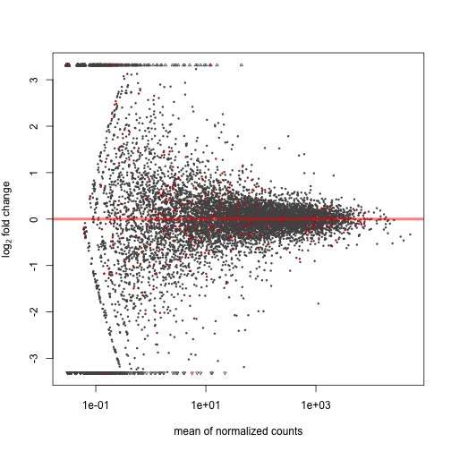

Seminar 7
========================================================


```r
library(ShortRead)
```

```
## Loading required package: BiocGenerics
## Loading required package: parallel
## 
## Attaching package: 'BiocGenerics'
## 
## The following objects are masked from 'package:parallel':
## 
##     clusterApply, clusterApplyLB, clusterCall, clusterEvalQ,
##     clusterExport, clusterMap, parApply, parCapply, parLapply,
##     parLapplyLB, parRapply, parSapply, parSapplyLB
## 
## The following object is masked from 'package:stats':
## 
##     xtabs
## 
## The following objects are masked from 'package:base':
## 
##     anyDuplicated, append, as.data.frame, as.vector, cbind,
##     colnames, duplicated, eval, evalq, Filter, Find, get,
##     intersect, is.unsorted, lapply, Map, mapply, match, mget,
##     order, paste, pmax, pmax.int, pmin, pmin.int, Position, rank,
##     rbind, Reduce, rep.int, rownames, sapply, setdiff, sort,
##     table, tapply, union, unique, unlist
## 
## Loading required package: IRanges
## Loading required package: GenomicRanges
## Loading required package: XVector
## Loading required package: Biostrings
## Loading required package: lattice
## Loading required package: Rsamtools
```

```r
library(Rsamtools)
bamDat <- readAligned("drosophilaMelanogasterSubset.bam", type = "BAM")
str(bamDat)
```

```
## Formal class 'AlignedRead' [package "ShortRead"] with 8 slots
##   ..@ chromosome  : Factor w/ 15 levels "chrYHet","chrM",..: 2 2 2 2 2 2 2 2 2 2 ...
##   ..@ position    : int [1:64206] 548 1497 1506 1528 1540 1552 1552 1555 1559 1566 ...
##   ..@ strand      : Factor w/ 3 levels "+","-","*": 2 1 1 1 1 1 1 1 2 2 ...
##   ..@ alignQuality:Formal class 'NumericQuality' [package "ShortRead"] with 1 slots
##   .. .. ..@ quality: int [1:64206] 132 132 127 130 130 122 132 132 132 132 ...
##   ..@ alignData   :Formal class 'AlignedDataFrame' [package "ShortRead"] with 4 slots
##   .. .. ..@ varMetadata      :'data.frame':	1 obs. of  1 variable:
##   .. .. .. ..$ labelDescription: chr "Type of read; see ?scanBam"
##   .. .. ..@ data             :'data.frame':	64206 obs. of  1 variable:
##   .. .. .. ..$ flag: int [1:64206] 16 0 0 0 0 0 0 0 16 16 ...
##   .. .. ..@ dimLabels        : chr [1:2] "readName" "alignColumn"
##   .. .. ..@ .__classVersion__:Formal class 'Versions' [package "Biobase"] with 1 slots
##   .. .. .. .. ..@ .Data:List of 1
##   .. .. .. .. .. ..$ : int [1:3] 1 1 0
##   ..@ quality     :Formal class 'FastqQuality' [package "ShortRead"] with 1 slots
##   .. .. ..@ quality:Formal class 'BStringSet' [package "Biostrings"] with 5 slots
##   .. .. .. .. ..@ pool           :Formal class 'SharedRaw_Pool' [package "XVector"] with 2 slots
##   .. .. .. .. .. .. ..@ xp_list                    :List of 1
##   .. .. .. .. .. .. .. ..$ :<externalptr> 
##   .. .. .. .. .. .. ..@ .link_to_cached_object_list:List of 1
##   .. .. .. .. .. .. .. ..$ :<environment: 0x107990548> 
##   .. .. .. .. ..@ ranges         :Formal class 'GroupedIRanges' [package "XVector"] with 7 slots
##   .. .. .. .. .. .. ..@ group          : int [1:64206] 1 1 1 1 1 1 1 1 1 1 ...
##   .. .. .. .. .. .. ..@ start          : int [1:64206] 1 37 73 109 145 181 217 253 289 325 ...
##   .. .. .. .. .. .. ..@ width          : int [1:64206] 36 36 36 36 36 36 36 36 36 36 ...
##   .. .. .. .. .. .. ..@ NAMES          : NULL
##   .. .. .. .. .. .. ..@ elementType    : chr "integer"
##   .. .. .. .. .. .. ..@ elementMetadata: NULL
##   .. .. .. .. .. .. ..@ metadata       : list()
##   .. .. .. .. ..@ elementType    : chr "BString"
##   .. .. .. .. ..@ elementMetadata: NULL
##   .. .. .. .. ..@ metadata       : list()
##   ..@ sread       :Formal class 'DNAStringSet' [package "Biostrings"] with 5 slots
##   .. .. ..@ pool           :Formal class 'SharedRaw_Pool' [package "XVector"] with 2 slots
##   .. .. .. .. ..@ xp_list                    :List of 1
##   .. .. .. .. .. ..$ :<externalptr> 
##   .. .. .. .. ..@ .link_to_cached_object_list:List of 1
##   .. .. .. .. .. ..$ :<environment: 0x107990548> 
##   .. .. ..@ ranges         :Formal class 'GroupedIRanges' [package "XVector"] with 7 slots
##   .. .. .. .. ..@ group          : int [1:64206] 1 1 1 1 1 1 1 1 1 1 ...
##   .. .. .. .. ..@ start          : int [1:64206] 1 37 73 109 145 181 217 253 289 325 ...
##   .. .. .. .. ..@ width          : int [1:64206] 36 36 36 36 36 36 36 36 36 36 ...
##   .. .. .. .. ..@ NAMES          : NULL
##   .. .. .. .. ..@ elementType    : chr "integer"
##   .. .. .. .. ..@ elementMetadata: NULL
##   .. .. .. .. ..@ metadata       : list()
##   .. .. ..@ elementType    : chr "DNAString"
##   .. .. ..@ elementMetadata: NULL
##   .. .. ..@ metadata       : list()
##   ..@ id          :Formal class 'BStringSet' [package "Biostrings"] with 5 slots
##   .. .. ..@ pool           :Formal class 'SharedRaw_Pool' [package "XVector"] with 2 slots
##   .. .. .. .. ..@ xp_list                    :List of 1
##   .. .. .. .. .. ..$ :<externalptr> 
##   .. .. .. .. ..@ .link_to_cached_object_list:List of 1
##   .. .. .. .. .. ..$ :<environment: 0x107990548> 
##   .. .. ..@ ranges         :Formal class 'GroupedIRanges' [package "XVector"] with 7 slots
##   .. .. .. .. ..@ group          : int [1:64206] 1 1 1 1 1 1 1 1 1 1 ...
##   .. .. .. .. ..@ start          : int [1:64206] 1 29 57 85 114 144 173 202 230 260 ...
##   .. .. .. .. ..@ width          : int [1:64206] 28 28 28 29 30 29 29 28 30 30 ...
##   .. .. .. .. ..@ NAMES          : NULL
##   .. .. .. .. ..@ elementType    : chr "integer"
##   .. .. .. .. ..@ elementMetadata: NULL
##   .. .. .. .. ..@ metadata       : list()
##   .. .. ..@ elementType    : chr "BString"
##   .. .. ..@ elementMetadata: NULL
##   .. .. ..@ metadata       : list()
```

```r
# Filtering BAM Files
library(easyRNASeq)
```

```
## Loading required package: genomeIntervals
## Loading required package: intervals
## 
## Attaching package: 'intervals'
## 
## The following object is masked from 'package:Biostrings':
## 
##     type
## 
## The following object is masked from 'package:GenomicRanges':
## 
##     reduce
## 
## The following objects are masked from 'package:IRanges':
## 
##     expand, reduce
```

```
## Warning: replacing previous import by 'intervals::coerce' when loading 'genomeIntervals'
## Warning: replacing previous import by 'intervals::initialize' when loading 'genomeIntervals'
```

```
## Loading required package: Biobase
## Welcome to Bioconductor
## 
##     Vignettes contain introductory material; view with
##     'browseVignettes()'. To cite Bioconductor, see
##     'citation("Biobase")', and for packages 'citation("pkgname")'.
## 
## Loading required package: biomaRt
## Loading required package: edgeR
## Loading required package: limma
## 
## Attaching package: 'limma'
## 
## The following object is masked from 'package:BiocGenerics':
## 
##     plotMA
## 
## Loading required package: DESeq
## Loading required package: locfit
## locfit 1.5-9.1 	 2013-03-22
## 
## Attaching package: 'locfit'
## 
## The following objects are masked from 'package:GenomicRanges':
## 
##     left, right
## 
##     Welcome to 'DESeq'. For improved performance, usability and
##     functionality, please consider migrating to 'DESeq2'.
```

```r
nFilt <- nFilter(2)

chrFilt <- chromosomeFilter(regex = "chr")
filt <- compose(nFilt, chrFilt)
bamDatFiltered <- bamDat[filt(bamDat)]

# Examining BAM Data
str(bamDatFiltered)
```

```
## Formal class 'AlignedRead' [package "ShortRead"] with 8 slots
##   ..@ chromosome  : Factor w/ 7 levels "chrM","chr2L",..: 1 1 1 1 1 1 1 1 1 1 ...
##   ..@ position    : int [1:56883] 548 1497 1506 1528 1540 1552 1552 1555 1559 1566 ...
##   ..@ strand      : Factor w/ 3 levels "+","-","*": 2 1 1 1 1 1 1 1 2 2 ...
##   ..@ alignQuality:Formal class 'NumericQuality' [package "ShortRead"] with 1 slots
##   .. .. ..@ quality: int [1:56883] 132 132 127 130 130 122 132 132 132 132 ...
##   ..@ alignData   :Formal class 'AlignedDataFrame' [package "ShortRead"] with 4 slots
##   .. .. ..@ varMetadata      :'data.frame':	1 obs. of  1 variable:
##   .. .. .. ..$ labelDescription: chr "Type of read; see ?scanBam"
##   .. .. ..@ data             :'data.frame':	56883 obs. of  1 variable:
##   .. .. .. ..$ flag: int [1:56883] 16 0 0 0 0 0 0 0 16 16 ...
##   .. .. ..@ dimLabels        : chr [1:2] "readName" "alignColumn"
##   .. .. ..@ .__classVersion__:Formal class 'Versions' [package "Biobase"] with 1 slots
##   .. .. .. .. ..@ .Data:List of 1
##   .. .. .. .. .. ..$ : int [1:3] 1 1 0
##   ..@ quality     :Formal class 'FastqQuality' [package "ShortRead"] with 1 slots
##   .. .. ..@ quality:Formal class 'BStringSet' [package "Biostrings"] with 5 slots
##   .. .. .. .. ..@ pool           :Formal class 'SharedRaw_Pool' [package "XVector"] with 2 slots
##   .. .. .. .. .. .. ..@ xp_list                    :List of 1
##   .. .. .. .. .. .. .. ..$ :<externalptr> 
##   .. .. .. .. .. .. ..@ .link_to_cached_object_list:List of 1
##   .. .. .. .. .. .. .. ..$ :<environment: 0x107990548> 
##   .. .. .. .. ..@ ranges         :Formal class 'GroupedIRanges' [package "XVector"] with 7 slots
##   .. .. .. .. .. .. ..@ group          : int [1:56883] 1 1 1 1 1 1 1 1 1 1 ...
##   .. .. .. .. .. .. ..@ start          : int [1:56883] 1 37 73 109 145 181 217 253 289 325 ...
##   .. .. .. .. .. .. ..@ width          : int [1:56883] 36 36 36 36 36 36 36 36 36 36 ...
##   .. .. .. .. .. .. ..@ NAMES          : NULL
##   .. .. .. .. .. .. ..@ elementType    : chr "integer"
##   .. .. .. .. .. .. ..@ elementMetadata: NULL
##   .. .. .. .. .. .. ..@ metadata       : list()
##   .. .. .. .. ..@ elementType    : chr "BString"
##   .. .. .. .. ..@ elementMetadata: NULL
##   .. .. .. .. ..@ metadata       : list()
##   ..@ sread       :Formal class 'DNAStringSet' [package "Biostrings"] with 5 slots
##   .. .. ..@ pool           :Formal class 'SharedRaw_Pool' [package "XVector"] with 2 slots
##   .. .. .. .. ..@ xp_list                    :List of 1
##   .. .. .. .. .. ..$ :<externalptr> 
##   .. .. .. .. ..@ .link_to_cached_object_list:List of 1
##   .. .. .. .. .. ..$ :<environment: 0x107990548> 
##   .. .. ..@ ranges         :Formal class 'GroupedIRanges' [package "XVector"] with 7 slots
##   .. .. .. .. ..@ group          : int [1:56883] 1 1 1 1 1 1 1 1 1 1 ...
##   .. .. .. .. ..@ start          : int [1:56883] 1 37 73 109 145 181 217 253 289 325 ...
##   .. .. .. .. ..@ width          : int [1:56883] 36 36 36 36 36 36 36 36 36 36 ...
##   .. .. .. .. ..@ NAMES          : NULL
##   .. .. .. .. ..@ elementType    : chr "integer"
##   .. .. .. .. ..@ elementMetadata: NULL
##   .. .. .. .. ..@ metadata       : list()
##   .. .. ..@ elementType    : chr "DNAString"
##   .. .. ..@ elementMetadata: NULL
##   .. .. ..@ metadata       : list()
##   ..@ id          :Formal class 'BStringSet' [package "Biostrings"] with 5 slots
##   .. .. ..@ pool           :Formal class 'SharedRaw_Pool' [package "XVector"] with 2 slots
##   .. .. .. .. ..@ xp_list                    :List of 1
##   .. .. .. .. .. ..$ :<externalptr> 
##   .. .. .. .. ..@ .link_to_cached_object_list:List of 1
##   .. .. .. .. .. ..$ :<environment: 0x107990548> 
##   .. .. ..@ ranges         :Formal class 'GroupedIRanges' [package "XVector"] with 7 slots
##   .. .. .. .. ..@ group          : int [1:56883] 1 1 1 1 1 1 1 1 1 1 ...
##   .. .. .. .. ..@ start          : int [1:56883] 1 29 57 85 114 144 173 202 230 260 ...
##   .. .. .. .. ..@ width          : int [1:56883] 28 28 28 29 30 29 29 28 30 30 ...
##   .. .. .. .. ..@ NAMES          : NULL
##   .. .. .. .. ..@ elementType    : chr "integer"
##   .. .. .. .. ..@ elementMetadata: NULL
##   .. .. .. .. ..@ metadata       : list()
##   .. .. ..@ elementType    : chr "BString"
##   .. .. ..@ elementMetadata: NULL
##   .. .. ..@ metadata       : list()
```

```r
levels(chromosome(bamDatFiltered))
```

```
## [1] "chrM"  "chr2L" "chrX"  "chr3L" "chr4"  "chr2R" "chr3R"
```

```r
id(bamDatFiltered)[1:10]
```

```
##   A BStringSet instance of length 10
##      width seq
##  [1]    28 HWI-EAS225_90320:3:1:141:680
##  [2]    28 HWI-EAS225_90320:3:1:660:332
##  [3]    28 HWI-EAS225_90320:3:1:164:226
##  [4]    29 HWI-EAS225_90320:3:1:1088:176
##  [5]    30 HWI-EAS225_90320:3:1:1038:1484
##  [6]    29 HWI-EAS225_90320:3:1:850:1742
##  [7]    29 HWI-EAS225_90320:3:1:1319:586
##  [8]    28 HWI-EAS225_90320:3:1:103:631
##  [9]    30 HWI-EAS225_90320:3:1:1353:1498
## [10]    30 HWI-EAS225_90320:3:1:1092:1016
```

```r
sread(bamDatFiltered)[1:10]
```

```
##   A DNAStringSet instance of length 10
##      width seq
##  [1]    36 GGAAATCAAAAATGGAAAGGAGCGGCTCCACTTTTT
##  [2]    36 AAATCATAAAGATATTGGAACTTTATATTTTATTTT
##  [3]    36 AGATATTGGAACTTTATATTTTATTTTTGGAGCTTG
##  [4]    36 ATTTTTGGAGCTTGAGCTGGAATAGTTGGAACATCT
##  [5]    36 TGAGCTGGAATAGTTGGAACATCTTTAAGAATTTTA
##  [6]    36 GTTGGAACATCTTTAAGAATTTTAATTAGAGCTGAA
##  [7]    36 GTTGGAACATCTTTAAGAATTTTAATTCGAGCTGAA
##  [8]    36 GGAACATCTTTAAGAATTTTAATTCGAGCTGAATTA
##  [9]    36 GTCCTAATTCAGCTCGAATTAAAATTCTTAAAGATG
## [10]    36 CCAGGATGTCCTAATTCAGCTCGAATTAAAATTCTT
```

```r
quality(bamDatFiltered)[1:10]
```

```
## class: FastqQuality
## quality:
##   A BStringSet instance of length 10
##      width seq
##  [1]    36 BACBCCABBBBBA>8@B@@==>;5-9A<;=7A@@B@
##  [2]    36 BCBBABBA@@B;B>AB@@<>:AAA9?>?A@A<?A@@
##  [3]    36 @?8AB>A?=)A=@*8>6/@3>A)/@4>?BA'(-1B=
##  [4]    36 BBCACCA@-4ABC62?*;A?BBA?B@.8B9?33;+=
##  [5]    36 ?5@A4::@@55;;89<'6?A8@A=4@=>54>76);A
##  [6]    36 A8=B;462>;7BCBAA>1;=</?BA94%<:?(7@9=
##  [7]    36 BBB>ABB@@BBBBCBCC@7ABBBAABB@B?AAA@=@
##  [8]    36 =B=ACCBBC8ACCCBBBCCCBB=CAB9=BBBB@2?:
##  [9]    36 @7ABBBBABBB?BAAB=@CBB;7ABAABBA?@;2=A
## [10]    36 BB>B?:ABABBBBABCB@@@BB@:@BA;>@;@B?AB
```

```r
position(bamDatFiltered)[1:10]
```

```
##  [1]  548 1497 1506 1528 1540 1552 1552 1555 1559 1566
```

```r
strand(bamDatFiltered)[1:10]
```

```
##  [1] - + + + + + + + - -
## Levels: + - *
```

```r

# Accessing Genome Annotations
library(BSgenome.Dmelanogaster.UCSC.dm3)
```

```
## Loading required package: BSgenome
```

```r
(chrSizes <- seqlengths(Dmelanogaster))
```

```
##     chr2L     chr2R     chr3L     chr3R      chr4      chrX      chrU 
##  23011544  21146708  24543557  27905053   1351857  22422827  10049037 
##      chrM  chr2LHet  chr2RHet  chr3LHet  chr3RHet   chrXHet   chrYHet 
##     19517    368872   3288761   2555491   2517507    204112    347038 
## chrUextra 
##  29004656
```

```r

library(biomaRt)
ensembl <- useMart("ensembl", dataset = "dmelanogaster_gene_ensembl")
annotation.fields <- c("ensembl_gene_id", "strand", "chromosome_name", "start_position", 
    "end_position")
gene.annotation <- getBM(annotation.fields, mart = ensembl, filters = "chromosome_name", 
    values = c("2L"))
str(gene.annotation)
```

```
## 'data.frame':	2986 obs. of  5 variables:
##  $ ensembl_gene_id: chr  "FBgn0031208" "FBgn0002121" "FBgn0031209" "FBgn0263584" ...
##  $ strand         : int  1 -1 -1 1 -1 1 1 1 -1 1 ...
##  $ chromosome_name: chr  "2L" "2L" "2L" "2L" ...
##  $ start_position : int  7529 9839 21823 21952 25402 66584 71757 76348 82421 94739 ...
##  $ end_position   : int  9484 21376 25155 24237 65404 71390 76211 77783 87387 102086 ...
```

```r
levels(as.factor(gene.annotation$chromosome))
```

```
## [1] "2L"
```

```r
gene.annotation$chromosome <- paste("chr", gene.annotation$chromosome_name, 
    sep = "")

levels(as.factor(gene.annotation$chromosome))
```

```
## [1] "chr2L"
```

```r
gene.range <- RangedData(IRanges(start = gene.annotation$start_position, end = gene.annotation$end_position), 
    space = gene.annotation$chromosome, strand = gene.annotation$strand, gene = gene.annotation$ensembl_gene_id, 
    universe = "Dm3")

show(gene.range)
```

```
## RangedData with 2986 rows and 2 value columns across 1 space
##         space               ranges   |    strand        gene
##      <factor>            <IRanges>   | <integer> <character>
## 1       chr2L       [ 7529,  9484]   |         1 FBgn0031208
## 2       chr2L       [ 9839, 21376]   |        -1 FBgn0002121
## 3       chr2L       [21823, 25155]   |        -1 FBgn0031209
## 4       chr2L       [21952, 24237]   |         1 FBgn0263584
## 5       chr2L       [25402, 65404]   |        -1 FBgn0051973
## 6       chr2L       [66584, 71390]   |         1 FBgn0067779
## 7       chr2L       [71757, 76211]   |         1 FBgn0031213
## 8       chr2L       [76348, 77783]   |         1 FBgn0031214
## 9       chr2L       [82421, 87387]   |        -1 FBgn0002931
## ...       ...                  ... ...       ...         ...
## 2978    chr2L [22690251, 22691008]   |        -1 FBgn0058439
## 2979    chr2L [22735486, 22736297]   |        -1 FBgn0262947
## 2980    chr2L [22736952, 22747273]   |         1 FBgn0041004
## 2981    chr2L [22811944, 22834955]   |         1 FBgn0002566
## 2982    chr2L [22841770, 22843208]   |        -1 FBgn0058005
## 2983    chr2L [22874534, 22885080]   |         1 FBgn0000384
## 2984    chr2L [22892306, 22918647]   |        -1 FBgn0250907
## 2985    chr2L [22959606, 22961179]   |        -1 FBgn0086683
## 2986    chr2L [22961737, 22963456]   |         1 FBgn0262887
```

```r
(cover <- coverage(bamDatFiltered, width = chrSizes))
```

```
## RleList of length 7
## $chrM
## integer-Rle of length 19517 with 953 runs
##   Lengths:  547   36  913    9   22    5 ...    3    5   13  258   36 5793
##   Values :    0    1    0    1    2    3 ...    4    3    2    0    1    0
## 
## $chr2L
## integer-Rle of length 23011544 with 17850 runs
##   Lengths:  6777    36  2316    36  1621 ...   107    36   499    36 50474
##   Values :     0     1     0     1     0 ...     0     1     0     1     0
## 
## $chrX
## integer-Rle of length 22422827 with 16522 runs
##   Lengths:  18996     36  12225     36 ...     36    130     36   6180
##   Values :      0      1      0      1 ...      1      0      1      0
## 
## $chr3L
## integer-Rle of length 24543557 with 17396 runs
##   Lengths: 135455     36   6783     23 ...     36  82251     36  12469
##   Values :      0      1      0      1 ...      1      0      1      0
## 
## $chr4
## integer-Rle of length 1351857 with 1255 runs
##   Lengths:  59510     36   2019     36 ...     36    267     36 118808
##   Values :      0      1      0      1 ...      1      0      1      0
## 
## ...
## <2 more elements>
```

```r

# Aggregating the coverage for each gene
gene.coverage <- aggregate(cover[match(names(gene.range), names(cover))], ranges(gene.range), 
    sum)

# Finding the number of reads covering each gene
gene.coverage <- ceiling(gene.coverage/unique(width(bamDat)))
gene.coverage
```

```
## NumericList of length 1
## [["chr2L"]] 1 47 0 0 1 6 0 0 8 11 1 1 58 ... 17 16 1 0 0 0 15 4 0 1 0 6 0
```

```r
# Note that the number of entities with coverage count on chromosome 2L is
# equal to the number of genes on chromosome 2L.
length(gene.coverage[["chr2L"]])
```

```
## [1] 2986
```

```r
length(ranges(gene.range)$chr2L)
```

```
## [1] 2986
```

```r
countTable <- data.frame(chromosome = gene.range$space, gene_start = start(gene.range$ranges), 
    gene_end = end(gene.range$ranges), strand = gene.range$strand, gene = gene.range$gene, 
    count = as.vector(gene.coverage[["chr2L"]]))
dim(countTable)
```

```
## [1] 2986    6
```

```r
head(countTable)
```

```
##   chromosome gene_start gene_end strand        gene count
## 1      chr2L       7529     9484      1 FBgn0031208     1
## 2      chr2L       9839    21376     -1 FBgn0002121    47
## 3      chr2L      21823    25155     -1 FBgn0031209     0
## 4      chr2L      21952    24237      1 FBgn0263584     0
## 5      chr2L      25402    65404     -1 FBgn0051973     1
## 6      chr2L      66584    71390      1 FBgn0067779     6
```

```r
countTable <- data.frame(chromosome = gene.range$space, gene_start = start(gene.range$ranges), 
    gene_end = end(gene.range$ranges), strand = gene.range$strand, gene = gene.range$gene, 
    count = as.vector(gene.coverage[["chr2L"]]), RPKM = (as.vector(gene.coverage[["chr2L"]])/(end(gene.range$ranges) - 
        start(gene.range$ranges))) * (1e+09/length(bamDat)))
head(countTable)
```

```
##   chromosome gene_start gene_end strand        gene count    RPKM
## 1      chr2L       7529     9484      1 FBgn0031208     1  7.9667
## 2      chr2L       9839    21376     -1 FBgn0002121    47 63.4497
## 3      chr2L      21823    25155     -1 FBgn0031209     0  0.0000
## 4      chr2L      21952    24237      1 FBgn0263584     0  0.0000
## 5      chr2L      25402    65404     -1 FBgn0051973     1  0.3894
## 6      chr2L      66584    71390      1 FBgn0067779     6 19.4443
```


```r
library(edgeR)
library(DESeq)
library(limma)
dat <- read.table("bottomly_count_table.tsv", header = TRUE, row.names = 1)
des <- read.table("bottomly_phenodata.tsv", header = TRUE, row.names = 1)

str(dat)
```

```
## 'data.frame':	36536 obs. of  21 variables:
##  $ SRX033480: int  369 0 0 0 0 0 21 15 517 0 ...
##  $ SRX033488: int  744 0 1 0 1 1 46 43 874 0 ...
##  $ SRX033481: int  287 0 0 0 1 0 20 12 340 0 ...
##  $ SRX033489: int  769 0 1 0 5 1 36 34 813 0 ...
##  $ SRX033482: int  348 0 1 0 0 0 12 14 378 0 ...
##  $ SRX033490: int  803 0 1 0 4 0 55 32 860 0 ...
##  $ SRX033483: int  433 0 0 0 0 0 27 19 528 0 ...
##  $ SRX033476: int  469 0 7 0 0 0 44 18 401 0 ...
##  $ SRX033478: int  585 0 6 0 0 0 32 44 584 0 ...
##  $ SRX033479: int  321 0 1 0 0 0 47 22 401 0 ...
##  $ SRX033472: int  301 0 1 0 4 0 40 17 331 0 ...
##  $ SRX033473: int  461 0 1 0 1 0 40 24 431 0 ...
##  $ SRX033474: int  309 0 1 0 1 0 30 29 341 0 ...
##  $ SRX033475: int  374 0 1 0 0 0 27 15 480 0 ...
##  $ SRX033491: int  781 0 1 0 1 0 46 34 930 0 ...
##  $ SRX033484: int  555 0 2 0 2 0 28 23 585 0 ...
##  $ SRX033492: int  820 0 1 0 1 0 40 38 1137 0 ...
##  $ SRX033485: int  294 0 1 0 1 0 21 17 490 0 ...
##  $ SRX033493: int  758 0 4 0 1 0 52 29 1079 0 ...
##  $ SRX033486: int  419 0 1 0 1 0 27 12 565 0 ...
##  $ SRX033494: int  857 0 5 0 2 0 45 28 726 0 ...
```

```r
all(rownames(des) == colnames(dat))
```

```
## [1] TRUE
```

```r
with(des, table(strain))
```

```
## strain
## C57BL/6J   DBA/2J 
##       10       11
```

```r
(group <- factor(c(rep("1", 10), rep("2", 11))))
```

```
##  [1] 1 1 1 1 1 1 1 1 1 1 2 2 2 2 2 2 2 2 2 2 2
## Levels: 1 2
```

```r
dge.glm <- DGEList(counts = dat, group = group)
design <- model.matrix(~group)
dge.glm.com.disp <- estimateGLMCommonDisp(dge.glm, design, verbose = TRUE)
```

```
## Disp = 0.03893 , BCV = 0.1973
```

```r
dge.glm.trend.disp <- estimateGLMTrendedDisp(dge.glm.com.disp)
```

```
## Loading required package: splines
```

```r
dge.glm.tag.disp <- estimateGLMTagwiseDisp(dge.glm.trend.disp, design)
plotBCV(dge.glm.tag.disp)
```

 

```r

fit <- glmFit(dge.glm.tag.disp, design)
colnames(coef(fit))
```

```
## [1] "(Intercept)" "group2"
```

```r


lrt <- glmLRT(fit, coef = 2)
topTags(lrt)
```

```
## Coefficient:  group2 
##                     logFC logCPM    LR    PValue       FDR
## ENSMUSG00000020912 -5.187  3.155 403.2 1.105e-89 4.037e-85
## ENSMUSG00000050141 -5.363  2.319 311.6 9.670e-70 1.767e-65
## ENSMUSG00000035775 -4.543  2.674 298.7 6.232e-67 7.589e-63
## ENSMUSG00000015484 -1.968  4.307 281.8 3.049e-63 2.785e-59
## ENSMUSG00000024248 -3.152  3.463 277.6 2.489e-62 1.819e-58
## ENSMUSG00000030532  1.547  5.572 268.9 1.961e-60 1.194e-56
## ENSMUSG00000054354 -6.283  1.940 248.7 4.924e-56 2.570e-52
## ENSMUSG00000023236  1.426  7.067 244.9 3.292e-55 1.503e-51
## ENSMUSG00000050824  3.705  3.365 230.0 6.054e-52 2.458e-48
## ENSMUSG00000015852 -2.362  3.138 214.8 1.212e-48 4.051e-45
```

```r

tt.glm <- topTags(lrt, n = Inf)
class(tt.glm)
```

```
## [1] "TopTags"
## attr(,"package")
## [1] "edgeR"
```

```r


nrow(tt.glm$table[tt.glm$table$FDR < 0.01, ])
```

```
## [1] 600
```

```r

interestingSamples <- rownames(tt.glm$table[tt.glm$table$FDR < 1e-50, ])
cpm(dge.glm.tag.disp)[interestingSamples, ]
```

```
##                    SRX033480 SRX033488 SRX033481 SRX033489 SRX033482
## ENSMUSG00000020912     20.39    12.691     15.83    14.819    19.230
## ENSMUSG00000050141     14.14    10.153     10.67     6.264     9.946
## ENSMUSG00000035775     14.47    10.629     19.51    11.305    12.930
## ENSMUSG00000015484     26.97    33.949     32.76    36.206    31.497
## ENSMUSG00000024248     14.80    26.017     17.30    23.527    18.567
## ENSMUSG00000030532     27.96    24.906     21.35    25.360    18.567
## ENSMUSG00000054354     10.85     7.615     11.41     8.708     8.289
## ENSMUSG00000023236     65.45    78.684     72.50    72.413    76.587
##                    SRX033490 SRX033483 SRX033476 SRX033478 SRX033479
## ENSMUSG00000020912    17.330    26.430    13.359    23.621    14.310
## ENSMUSG00000050141     7.890     8.361     6.583    11.911    12.402
## ENSMUSG00000035775    12.540    12.136     6.389    13.527    11.210
## ENSMUSG00000015484    33.393    30.745    34.655    26.851    31.482
## ENSMUSG00000024248    25.784    18.879    24.781    14.334    14.310
## ENSMUSG00000030532    26.770    26.430    19.167    23.217    20.034
## ENSMUSG00000054354     7.608     7.012     3.291     4.442     5.963
## ENSMUSG00000023236    80.875    83.336    55.178    57.740    66.303
##                    SRX033472 SRX033473 SRX033474 SRX033475 SRX033491
## ENSMUSG00000020912    0.5037    0.4226    1.0805    0.2802    1.0995
## ENSMUSG00000050141    0.2518    0.0000    0.0000    0.2802    0.8246
## ENSMUSG00000035775    0.7555    0.0000    0.2701    0.2802    0.6872
## ENSMUSG00000015484    7.0516    4.8595    9.1841    7.8443    8.5209
## ENSMUSG00000024248    2.2666    1.2677    1.8908    3.3618    3.1610
## ENSMUSG00000030532   69.7605   70.5683   63.2082   63.0343   73.8023
## ENSMUSG00000054354    0.0000    0.0000    0.0000    0.0000    0.5497
## ENSMUSG00000023236  195.4301  183.6044  176.1186  156.3252  206.9762
##                    SRX033484 SRX033492 SRX033485 SRX033493 SRX033486
## ENSMUSG00000020912    0.0000    0.7027    0.8651    0.1362    0.0000
## ENSMUSG00000050141    0.0000    0.1405    0.0000    0.1362    0.2578
## ENSMUSG00000035775    0.6784    0.1405    0.5767    0.1362    1.8045
## ENSMUSG00000015484    9.4974    8.4319    8.9396    6.6759   10.3116
## ENSMUSG00000024248    1.5829    1.6864    1.7302    1.7712    2.5779
## ENSMUSG00000030532   70.0997   70.6873   62.5770   78.6123   59.2919
## ENSMUSG00000054354    0.0000    0.0000    0.0000    0.0000    0.0000
## ENSMUSG00000023236  177.9628  192.8090  207.0519  201.6399  204.6859
##                    SRX033494
## ENSMUSG00000020912    0.0000
## ENSMUSG00000050141    0.1477
## ENSMUSG00000035775    0.5907
## ENSMUSG00000015484    8.8604
## ENSMUSG00000024248    3.1012
## ENSMUSG00000030532   71.3265
## ENSMUSG00000054354    0.0000
## ENSMUSG00000023236  192.7144
```

```r

summary(de.glm <- decideTestsDGE(lrt, p = 0.05, adjust = "BH"))
```

```
##    [,1] 
## -1   451
## 0  35660
## 1    425
```

```r

# Plot log fold changes against log-cpm
tags.glm <- rownames(dge.glm.tag.disp)[as.logical(de.glm)]
plotSmear(lrt, de.tags = tags.glm)
abline(h = c(-2, 2), col = "blue")
```

 


```r
## DESeq

```

```r
deSeqDat <- newCountDataSet(dat, group)
head(counts(deSeqDat))
```

```
##                    SRX033480 SRX033488 SRX033481 SRX033489 SRX033482
## ENSMUSG00000000001       369       744       287       769       348
## ENSMUSG00000000003         0         0         0         0         0
## ENSMUSG00000000028         0         1         0         1         1
## ENSMUSG00000000031         0         0         0         0         0
## ENSMUSG00000000037         0         1         1         5         0
## ENSMUSG00000000049         0         1         0         1         0
##                    SRX033490 SRX033483 SRX033476 SRX033478 SRX033479
## ENSMUSG00000000001       803       433       469       585       321
## ENSMUSG00000000003         0         0         0         0         0
## ENSMUSG00000000028         1         0         7         6         1
## ENSMUSG00000000031         0         0         0         0         0
## ENSMUSG00000000037         4         0         0         0         0
## ENSMUSG00000000049         0         0         0         0         0
##                    SRX033472 SRX033473 SRX033474 SRX033475 SRX033491
## ENSMUSG00000000001       301       461       309       374       781
## ENSMUSG00000000003         0         0         0         0         0
## ENSMUSG00000000028         1         1         1         1         1
## ENSMUSG00000000031         0         0         0         0         0
## ENSMUSG00000000037         4         1         1         0         1
## ENSMUSG00000000049         0         0         0         0         0
##                    SRX033484 SRX033492 SRX033485 SRX033493 SRX033486
## ENSMUSG00000000001       555       820       294       758       419
## ENSMUSG00000000003         0         0         0         0         0
## ENSMUSG00000000028         2         1         1         4         1
## ENSMUSG00000000031         0         0         0         0         0
## ENSMUSG00000000037         2         1         1         1         1
## ENSMUSG00000000049         0         0         0         0         0
##                    SRX033494
## ENSMUSG00000000001       857
## ENSMUSG00000000003         0
## ENSMUSG00000000028         5
## ENSMUSG00000000031         0
## ENSMUSG00000000037         2
## ENSMUSG00000000049         0
```

```r

deSeqDat <- estimateSizeFactors(deSeqDat)

deSeqDat <- estimateDispersions(deSeqDat)

# Plotting the estimated dispersions against the mean normalized counts
plotDispEsts(deSeqDat)
```

 


```r
results <- nbinomTest(deSeqDat, levels(group)[1], levels(group)[2])
plotMA(results)
```

 


```r
norm.factor <- calcNormFactors(dat)
dat.voomed <- voom(dat, design, plot = TRUE, lib.size = colSums(dat) * norm.factor)
```

 

```r
dat.voomed
```

```
## An object of class "EList"
## $E
##                    SRX033480 SRX033488 SRX033481 SRX033489 SRX033482
## ENSMUSG00000000001     6.941     6.916     6.720     6.871     6.860
## ENSMUSG00000000003    -2.588    -3.625    -2.447    -3.716    -2.585
## ENSMUSG00000000028    -2.588    -2.040    -2.447    -2.132    -1.000
## ENSMUSG00000000031    -2.588    -3.625    -2.447    -3.716    -2.585
## ENSMUSG00000000037    -2.588    -2.040    -0.862    -0.257    -2.585
##                    SRX033490 SRX033483 SRX033476 SRX033478 SRX033479
## ENSMUSG00000000001    6.8447      6.87    6.4977    6.8899     6.279
## ENSMUSG00000000003   -3.8055     -2.89   -3.3773   -3.3036    -3.049
## ENSMUSG00000000028   -2.2205     -2.89    0.5296    0.3968    -1.465
## ENSMUSG00000000031   -3.8055     -2.89   -3.3773   -3.3036    -3.049
## ENSMUSG00000000037   -0.6355     -2.89   -3.3773   -3.3036    -3.049
##                    SRX033472 SRX033473 SRX033474 SRX033475 SRX033491
## ENSMUSG00000000001    6.2110     6.615     6.397     6.693     6.737
## ENSMUSG00000000003   -3.0250    -3.236    -2.877    -2.855    -3.873
## ENSMUSG00000000028   -1.4400    -1.651    -1.292    -1.270    -2.288
## ENSMUSG00000000031   -3.0250    -3.236    -2.877    -2.855    -3.873
## ENSMUSG00000000037    0.1449    -1.651    -1.292    -2.855    -2.288
##                    SRX033484 SRX033492 SRX033485 SRX033493 SRX033486
## ENSMUSG00000000001    6.9151     6.855     6.375     6.718     6.760
## ENSMUSG00000000003   -3.2025    -3.825    -2.827    -3.849    -2.952
## ENSMUSG00000000028   -0.8806    -2.240    -1.242    -0.679    -1.367
## ENSMUSG00000000031   -3.2025    -3.825    -2.827    -3.849    -2.952
## ENSMUSG00000000037   -0.8806    -2.240    -1.242    -2.264    -1.367
##                    SRX033494
## ENSMUSG00000000001     7.005
## ENSMUSG00000000003    -3.739
## ENSMUSG00000000028    -0.280
## ENSMUSG00000000031    -3.739
## ENSMUSG00000000037    -1.417
## 36531 more rows ...
## 
## $weights
##        [,1]   [,2]   [,3]   [,4]   [,5]   [,6]   [,7]   [,8]   [,9]  [,10]
## [1,] 15.907 19.293 15.443 19.597 15.899 19.891 16.895 18.482 18.240 17.413
## [2,]  1.632  1.547  1.632  1.531  1.632  1.517  1.632  1.595  1.612  1.632
## [3,]  1.469  1.383  1.488  1.378  1.470  1.374  1.436  1.397  1.402  1.421
## [4,]  1.632  1.547  1.632  1.531  1.632  1.517  1.632  1.595  1.612  1.632
## [5,]  1.558  1.421  1.585  1.414  1.558  1.407  1.507  1.445  1.453  1.484
##       [,11]  [,12]  [,13]  [,14]  [,15]  [,16]  [,17]  [,18]  [,19]  [,20]
## [1,] 16.988 17.670 16.503 16.432 19.760 17.564 19.603 16.339 19.682 16.748
## [2,]  1.632  1.632  1.632  1.632  1.531  1.632  1.539  1.632  1.535  1.632
## [3,]  1.403  1.390  1.415  1.416  1.354  1.392  1.358  1.419  1.356  1.409
## [4,]  1.632  1.632  1.632  1.632  1.531  1.632  1.539  1.632  1.535  1.632
## [5,]  1.423  1.406  1.437  1.439  1.370  1.409  1.373  1.442  1.371  1.429
##       [,21]
## [1,] 19.318
## [2,]  1.555
## [3,]  1.364
## [4,]  1.555
## [5,]  1.377
## 36531 more rows ...
## 
## $design
##   (Intercept) group2
## 1           1      0
## 2           1      0
## 3           1      0
## 4           1      0
## 5           1      0
## 16 more rows ...
## 
## $targets
## [1] 3006197 6166939 2726341 6572633 3000692
## 16 more rows ...
```


```r
# Fit the model
fit <- lmFit(dat.voomed, design)
fit <- eBayes(fit)
topTable(fit)
```

```
##                    X.Intercept.    group2 AveExpr      F   P.Value
## ENSMUSG00000025867       12.477 -0.013979  12.471 154234 2.584e-55
## ENSMUSG00000022892       12.268 -0.086479  12.223 138459 1.103e-54
## ENSMUSG00000037852       12.321 -0.237470  12.194 134826 1.576e-54
## ENSMUSG00000042700       10.716 -0.048029  10.692 133973 1.717e-54
## ENSMUSG00000029461       10.300  0.020715  10.311 121795 6.182e-54
## ENSMUSG00000020658        9.610 -0.019628   9.601 119935 7.604e-54
## ENSMUSG00000060261        9.469 -0.015743   9.461 117841 9.635e-54
## ENSMUSG00000032549       11.904  0.003545  11.905 117324 1.022e-53
## ENSMUSG00000024462       10.227 -0.138929  10.153 116767 1.090e-53
## ENSMUSG00000030102       12.085 -0.026149  12.073 112155 1.874e-53
##                    adj.P.Val
## ENSMUSG00000025867 9.442e-51
## ENSMUSG00000022892 1.568e-50
## ENSMUSG00000037852 1.568e-50
## ENSMUSG00000042700 1.568e-50
## ENSMUSG00000029461 4.424e-50
## ENSMUSG00000020658 4.424e-50
## ENSMUSG00000060261 4.424e-50
## ENSMUSG00000032549 4.424e-50
## ENSMUSG00000024462 4.424e-50
## ENSMUSG00000030102 6.417e-50
```


