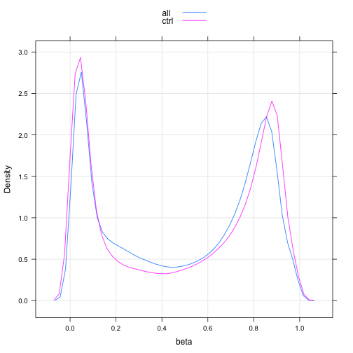
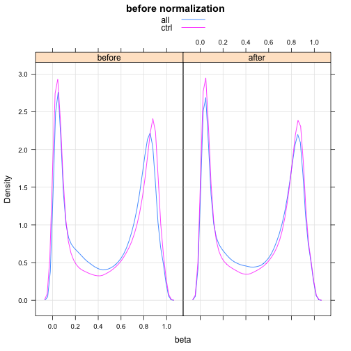
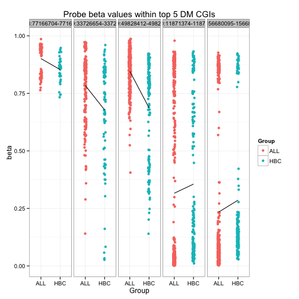
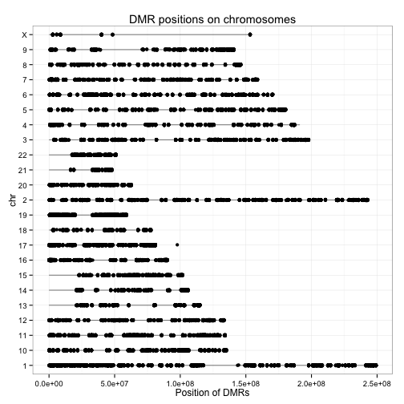

```r

library(GEOquery)
```

```
## Loading required package: Biobase
## Loading required package: BiocGenerics
## Loading required package: parallel
## 
## Attaching package: 'BiocGenerics'
## 
## The following objects are masked from 'package:parallel':
## 
##     clusterApply, clusterApplyLB, clusterCall, clusterEvalQ,
##     clusterExport, clusterMap, parApply, parCapply, parLapply,
##     parLapplyLB, parRapply, parSapply, parSapplyLB
## 
## The following object is masked from 'package:stats':
## 
##     xtabs
## 
## The following objects are masked from 'package:base':
## 
##     anyDuplicated, append, as.data.frame, as.vector, cbind,
##     colnames, duplicated, eval, evalq, Filter, Find, get,
##     intersect, is.unsorted, lapply, Map, mapply, match, mget,
##     order, paste, pmax, pmax.int, pmin, pmin.int, Position, rank,
##     rbind, Reduce, rep.int, rownames, sapply, setdiff, sort,
##     table, tapply, union, unique, unlist
## 
## Welcome to Bioconductor
## 
##     Vignettes contain introductory material; view with
##     'browseVignettes()'. To cite Bioconductor, see
##     'citation("Biobase")', and for packages 'citation("pkgname")'.
## 
## Setting options('download.file.method.GEOquery'='auto')
```

```r
library(wateRmelon)
```

```
## Loading required package: limma
## 
## Attaching package: 'limma'
## 
## The following object is masked from 'package:BiocGenerics':
## 
##     plotMA
## 
## Loading required package: matrixStats
## matrixStats v0.8.14 (2013-11-23) successfully loaded. See ?matrixStats for help.
## 
## Attaching package: 'matrixStats'
## 
## The following objects are masked from 'package:Biobase':
## 
##     anyMissing, rowMedians
## 
## Loading required package: methylumi
## Loading required package: scales
## Loading required package: reshape2
## Loading required package: ggplot2
```

```
## Warning: replacing previous import by 'graphics::image' when loading
## 'methylumi'
```

```
## Loading required package: lumi
## KernSmooth 2.23 loaded
## Copyright M. P. Wand 1997-2009
```

```
## Warning: replacing previous import by 'nleqslv::nleqslv' when loading
## 'lumi'
```

```
## 
## Attaching package: 'lumi'
## 
## The following objects are masked from 'package:methylumi':
## 
##     estimateM, getHistory
## 
## Loading required package: IlluminaHumanMethylation450k.db
## Loading required package: AnnotationDbi
## Loading required package: org.Hs.eg.db
## Loading required package: DBI
```

```
## Warning: 'IlluminaHumanMethylation450k.db' is deprecated.
## Use 'FDb.InfiniumMethylation.hg19' instead.
## Use 'FDb.InfiniumMethylation.hg18' instead.
## Use 'mapToGenome() function in minfi or methylumi' instead.
## See help("Deprecated")
```

```
## Loading required package: ROC
```

```r
library(IlluminaHumanMethylation450k.db)
library(lattice)
library(limma)
library(gplots)
```

```
## 
## Attaching package: 'gplots'
## 
## The following object is masked from 'package:stats':
## 
##     lowess
```

```r


# Query GEO, get data
if (file.exists("methyl_ALL.Rdata")) {
    # if previously downloaded
    load("methyl_ALL.Rdata")
} else {
    # if downloading for the first time
    GSE39141 <- getGEO("GSE39141")
    show(GSE39141)  ## 33 samples (29 ALL and 4 healthy B cells)
    GSE42865 <- getGEO("GSE42865")  # took ~2 mins for JB
    show(GSE42865)  ## 16 samples (9 healthy cells B cells and 7 other cells)
    
    # Extract expression matrices (turn into data frames at once)
    ALL.dat <- as.data.frame(exprs(GSE39141[[1]]))
    CTRL.dat <- as.data.frame(exprs(GSE42865[[1]]))
    
    # Obtain the meta-data for the samples and rename them perhaps?
    ALL.meta <- pData(phenoData(GSE39141[[1]]))
    CTRL.meta <- pData(phenoData(GSE42865[[1]]))
    
    # create some labels
    ALL.meta$Group <- c(rep("ALL", 29), rep("HBC", 4))
    ## ALL: Case; HBC: Healthy B Cells
    
    # Subset both meta-data and data for control (healthy) donors
    CTRL.meta <- droplevels(subset(CTRL.meta, grepl("Healthy donor", characteristics_ch1.1)))
    CTRL.dat <- subset(CTRL.dat, select = as.character(CTRL.meta$geo_accession))
    
    # Rename variables
    names(ALL.dat) <- paste(ALL.meta$Group, gsub("GSM", "", names(ALL.dat)), 
        sep = "_")
    names(CTRL.dat) <- paste("HBC", gsub("GSM", "", names(CTRL.dat)), sep = "_")
    
    # save the data to avoid future re-downloading
    save(ALL.dat, CTRL.dat, ALL.meta, CTRL.meta, file = "methyl_ALL.Rdata")
}
```


```r
ALL.mean <- rowMeans(ALL.dat, na.rm = T)
CTRL.mean <- rowMeans(CTRL.dat, na.rm = T)
dCombined <- data.frame(beta = c(ALL.mean, CTRL.mean), type = c(rep("all", length(ALL.mean)), 
    rep("ctrl", length(CTRL.mean))))

densityplot(~beta, dCombined, groups = type, grid = TRUE, plot.points = FALSE, 
    auto.key = TRUE)
```

 


```r
# Combine data from two experiments into one matrix, each column represents
# beta values of one sample
beta.matrix <- as.matrix(cbind(ALL.dat, CTRL.dat))
str(beta.matrix, max.level = 0)
```

```
##  num [1:485577, 1:42] 0.512 0.911 0.857 0.149 0.729 ...
##  - attr(*, "dimnames")=List of 2
```


**time**

```r
# Quantile normalization
system.time(beta.norm <- betaqn(beta.matrix))
```

```
##    user  system elapsed 
##  37.919   6.484  45.249
```


```r
dCombined <- cbind(dCombined, norm = rep("before", length(dCombined)))
ALL.after <- rowMeans(beta.norm[, grep("ALL", colnames(beta.norm))], na.rm = T)
CTRL.after <- rowMeans(beta.norm[, grep("ALL", colnames(beta.norm), invert = TRUE)], 
    na.rm = T)
after <- data.frame(beta = c(ALL.after, CTRL.after), type = c(rep("all", length(ALL.after)), 
    rep("ctrl", length(CTRL.after))), norm = "after")
everything <- rbind(dCombined, after)

densityplot(~beta | norm, everything, groups = type, grid = TRUE, plot.points = FALSE, 
    auto.key = TRUE, main = "before normalization")
```

 


** M values**


```r
M.norm <- beta2m(beta.norm)
```


```r
# Extract probe ID to CpG islands association
cginame <- as.data.frame(IlluminaHumanMethylation450kCPGINAME)
names(cginame) <- c("Probe_ID", "cginame")
rownames(cginame) <- cginame$Probe_ID
length(levels(factor(cginame$cginame)))  # No. of CGIs
```

```
## [1] 27176
```

```r

# Restrict probes to those within CGIs
beta.inCGI <- beta.norm[cginame$Probe_ID, ]
M.inCGI <- M.norm[cginame$Probe_ID, ]
nrow(M.inCGI)  # No. of probes within CGIs
```

```
## [1] 309465
```

```r

# Aggregate probes to CGIs (beta)
beta.CGI <- aggregate(beta.inCGI, by = list(cginame$cginame), mean, na.rm = T)
rownames(beta.CGI) <- beta.CGI[, "Group.1"]
beta.CGI <- subset(beta.CGI, select = -Group.1)
str(beta.CGI, max.level = 0)
```

```
## 'data.frame':	27176 obs. of  42 variables:
```

```r

# Aggregate probes to CGIs (M values)
M.CGI <- aggregate(M.inCGI, by = list(cginame$cginame), mean, na.rm = T)
rownames(M.CGI) <- M.CGI[, "Group.1"]
M.CGI <- subset(M.CGI, select = -Group.1)
str(M.CGI, max.level = 0)
```

```
## 'data.frame':	27176 obs. of  42 variables:
```


```r
library(reshape2)
M.CGI.tall <- melt(t(M.CGI), value.name = "M", varnames = c("Sample", "CGI"))
M.CGI.tall$Group <- substring(M.CGI.tall$Sample, 1, 3)
(M.boxplot <- ggplot(data = M.CGI.tall, aes(Sample, M, colour = Group)) + geom_boxplot() + 
    ggtitle("Bloxplot of CGI M values") + xlab("Samples") + ylab("M Values") + 
    scale_x_discrete(labels = NULL))
```

```
## Warning: Removed 15924 rows containing non-finite values (stat_boxplot).
## Warning: is.na() applied to non-(list or vector) of type 'NULL'
```

 


**Limma**

```r

design <- data.frame(Group = relevel(factor(gsub("_[0-9]+", "", colnames(M.CGI))), 
    ref = "HBC"), row.names = colnames(M.CGI))
str(design)
```

```
## 'data.frame':	42 obs. of  1 variable:
##  $ Group: Factor w/ 2 levels "HBC","ALL": 2 2 2 2 2 2 2 2 2 2 ...
```

```r

DesMat <- model.matrix(~Group, design)

DMRfit <- lmFit(M.CGI, DesMat)
DMRfitEb <- eBayes(DMRfit)
cutoff <- 0.01
DMR <- topTable(DMRfitEb, coef = "GroupALL", number = Inf, p.value = cutoff)
head(DMR)
```

```
##                            logFC AveExpr      t   P.Value adj.P.Val     B
## chr19:49828412-49828668   1.3084   2.283  12.05 2.798e-15 7.604e-11 24.31
## chr4:156680095-156681386 -1.1115  -2.521 -10.95 6.245e-14 8.485e-10 21.39
## chr20:11871374-11872207  -1.2639  -2.284 -10.49 2.370e-13 1.803e-09 20.13
## chr19:33726654-33726946   0.9429   1.887  10.39 3.172e-13 1.803e-09 19.85
## chr18:77166704-77167043   0.8104   3.199  10.36 3.429e-13 1.803e-09 19.78
## chr18:46447718-46448083  -0.8990   2.034 -10.31 3.980e-13 1.803e-09 19.64
```

**top hits**

```r
# Plot the top 100 hits
DMR100 <- topTable(DMRfitEb, coef = "GroupALL", number = 100)
DMR.CGI <- t(as.matrix(subset(beta.CGI, rownames(beta.CGI) %in% rownames(DMR100))))
str(DMR.CGI, max.level = 0)
```

```
##  num [1:42, 1:100] 0.707 0.688 0.69 0.728 0.692 ...
##  - attr(*, "dimnames")=List of 2
```

```r

col <- c(rep("darkgoldenrod1", times = nrow(DMR.CGI)))
col[grepl("HBC", rownames(DMR.CGI))] <- "forestgreen"
op <- par(mai = rep(0.5, 4))
heatmap.2(DMR.CGI, col = redblue(256), RowSideColors = col, density.info = "none", 
    trace = "none", Rowv = TRUE, Colv = TRUE, labCol = FALSE, labRow = FALSE, 
    dendrogram = "row", margins = c(1, 5))
legend("topright", c("ALL", "HBC"), col = c("darkgoldenrod1", "forestgreen"), 
    pch = 15)
```

 

```r
par(op)
```


```r
DMR5 <- topTable(DMRfitEb, coef = "GroupALL", number = 5)
beta.DMR5probe <- beta.inCGI[cginame[rownames(beta.inCGI), ]$cginame %in% rownames(DMR5), 
    ]
beta.DMR5probe.tall <- melt(beta.DMR5probe, value.name = "M", varnames = c("Probe_ID", 
    "Sample"))
beta.DMR5probe.tall$Group <- factor(gsub("_[0-9]+", "", beta.DMR5probe.tall$Sample))
beta.DMR5probe.tall$CGI <- factor(cginame[as.character(beta.DMR5probe.tall$Probe_ID), 
    ]$cginame)
(beta.DMR5.stripplot <- ggplot(data = beta.DMR5probe.tall, aes(x = Group, y = M, 
    color = Group)) + geom_point(position = position_jitter(width = 0.05), na.rm = T) + 
    stat_summary(fun.y = mean, aes(group = 1), geom = "line", color = "black") + 
    facet_grid(. ~ CGI) + ggtitle("Probe beta values within top 5 DM CGIs") + 
    xlab("Group") + ylab("beta") + theme_bw())
```

```
## Warning: Removed 3 rows containing missing values (stat_summary).
## Warning: Removed 1 rows containing missing values (stat_summary).
## Warning: Removed 2 rows containing missing values (stat_summary).
## Warning: Removed 3 rows containing missing values (stat_summary).
```

 


```r
# get the length of chromosome 1-22 and X
chrlen <- unlist(as.list(IlluminaHumanMethylation450kCHRLENGTHS)[c(as.character(1:22), 
    "X")])
chrlen <- data.frame(chr = factor(names(chrlen)), length = chrlen)
chr <- IlluminaHumanMethylation450kCHR  # get the chromosome of each probe
# get the probe identifiers that are mapped to chromosome
chr <- unlist(as.list(chr[mappedkeys(chr)]))
# get chromosome coordinate of each probe
coord <- IlluminaHumanMethylation450kCPGCOORDINATE
# get the probe identifiers that are mapped to coordinate
coord <- unlist(as.list(coord[mappedkeys(coord)]))
coord <- data.frame(chr = chr[intersect(names(chr), names(coord))], coord = coord[intersect(names(chr), 
    names(coord))])
# coordinates of probes in DM CGIs
coordDMRprobe <- droplevels(na.omit(coord[cginame[cginame$cginame %in% rownames(DMR), 
    ]$Probe_ID, ]))
(coord.plot <- ggplot(data = coordDMRprobe) + geom_linerange(aes(factor(chr, 
    levels = c("X", as.character(22:1))), ymin = 0, ymax = length), data = chrlen, 
    alpha = 0.5) + geom_point(aes(x = factor(chr, levels = c("X", as.character(22:1))), 
    y = coord), position = position_jitter(width = 0.03), na.rm = T) + ggtitle("DMR positions on chromosomes") + 
    ylab("Position of DMRs") + xlab("chr") + coord_flip() + theme_bw())
```

 


